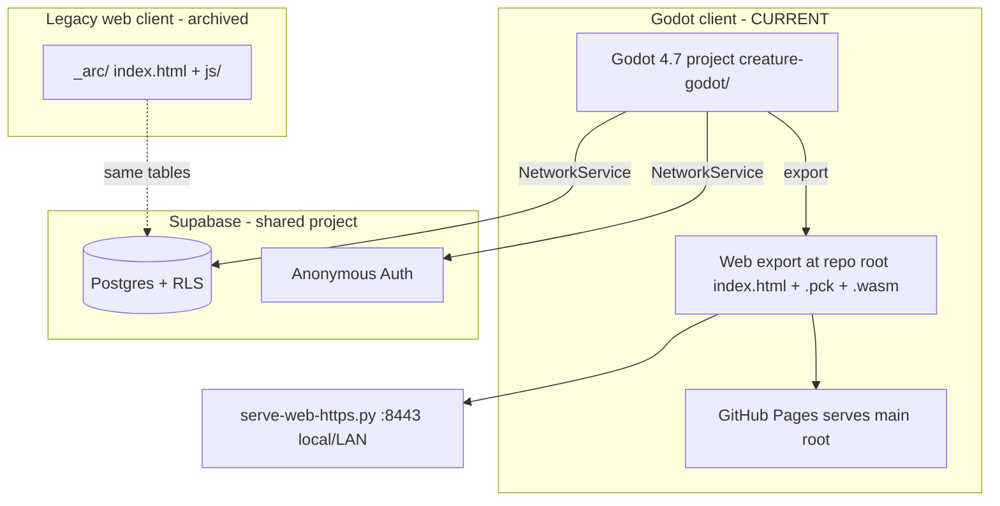

# Creature

> **🤖 AI agents:** start at [`_agent_index.md`](_agent_index.md) — it routes you to focused topic docs in [`docs/`](docs/) so you don't need to read this whole file. This README is the full historical record (search it; don't read linearly).

Multiplayer **alien shapeshifting** sandbox (pivot). Players spawn as aliens at a landfill, shapeshift into Memphis world objects (Rusty Altima, Magnolia Tree, Pothole, Propane Tank…), and kill/counter each other in funny ways. The old Tamagotchi creature field is the technical base being pivoted from.

> **📄 GAME DESIGN — READ FIRST:** the authoritative design is the PDF in the repo root: **`Multiplayer Alien Shapeshifting Prototype.pdf`**. It defines the pitch, forms, the kill/collision matrix, the money system, shapeshift rules, and the phased build order. Future agents should read it before changing gameplay. (`_moe_brainstorming.txt` holds looser notes.)

**Design source of truth (local, gitignored):** `_first.txt` — full product vision, Supabase project ref, and credentials (never commit).

---

## Slice 1 — shapeshifting prototype

The Phase-1 fun loop from the PDF is built in the Godot client:

- **Forms & shapeshifting** — `alien` (default worm) plus `altima`, `magnolia_tree`, `pothole`, `propane_tank`. Stand near an interactive object → **Become** (1s hold) → your body becomes that object with its speed/collision/kill rules. **Pop Out** returns you to alien; the object **stays where you parked it** and you step off beside it (rooted pyramid/safe house: structure stays put, alien steps aside). Forms are defined centrally in [`creature-godot/scripts/forms/form_defs.gd`](creature-godot/scripts/forms/form_defs.gd); shared procedural meshes in [`scripts/forms/object_mesh.gd`](creature-godot/scripts/forms/object_mesh.gd). A shapeshifted form renders at the **same 1:1 size** as its source world prop.
- **Landfill Dump** — spawn/respawn zone (bottom-left) with starter junk. `GameConfig.LANDFILL_RECT` / `LANDFILL_CENTER`.
- **Kill/collision matrix** — Altima squishes aliens; tree/pothole/building/propane wreck an Altima; propane explodes (bright, visible blast + light) with a lethal radius. Death shows a funny line and respawns you at the dump. **Kills are CLIENT-LOCAL:** each client only ever decides whether *its own* player dies (remote blast damage is not synced in Slice 1).
- **World-object shared state (Supabase)** — interactive objects live in a shared `public.world_objects` table so all clients agree on them. Becoming an object marks it `possessed` (hidden as a standalone prop for everyone → no duplicate); popping out releases it `idle` at your current spot so it **persists for everyone, even across disconnect**. The client **degrades gracefully** if the table doesn't exist yet (falls back to client-local placement, logs a notice).
- **Form sync** — `creatures.form` column syncs each player's current form so others see your Altima/tree/etc.
- **Region label** — bottom-left HUD label shows the current region (sub-zones like **"The Dump"** win, then the Memphis regions from `MemphisLayout.REGIONS` — Downtown, Midtown, Mud Island, etc.); extend `GameConfig.region_for_tile()` / `MemphisLayout` for new regions.
- **Toasts** — shapeshift/death/status messages appear as a **top banner** (out of the way).

### Required Supabase migrations

Run in the Supabase SQL Editor (Dashboard → SQL → New query):

| Migration | Purpose | Status |
|-----------|---------|--------|
| [`supabase/schema.sql`](supabase/schema.sql) | Base tables + RLS (now also includes `world_objects`) | applied |
| [`supabase/migration-temp-profile-admin.sql`](supabase/migration-temp-profile-admin.sql) | Temp name-claim + admin delete | applied |
| [`supabase/migration-forms.sql`](supabase/migration-forms.sql) | Adds `creatures.form` (form sync) | **applied** |
| [`supabase/migration-world-objects.sql`](supabase/migration-world-objects.sql) | Adds `public.world_objects` (shared/persistent interactive objects) | **applied** |
| [`supabase/migration-money.sql`](supabase/migration-money.sql) | Adds `world_objects.owner_name` (Slice 2 money labels) | **RUN for owner labels** |
| [`supabase/migration-pattern-lock.sql`](supabase/migration-pattern-lock.sql) | Adds `creatures.pattern_hash` (Slice 7 pattern-lock login/register) | **RUN for pattern auth** |
| [`supabase/migration-announcements.sql`](supabase/migration-announcements.sql) | Adds `public.announcements` (developer broadcasts, seeds a "Test" row) | **RUN for announcements** |

Until `migration-world-objects.sql` is run, interactive objects stay client-local (no cross-player sync / persistence), but the game still works. Without `migration-pattern-lock.sql`, login/register still works but pattern verification is skipped gracefully (client detects missing column).

---

## Slice 2 — money system (current, playtested)

Physical, persistent, synced **money** plus two **transport forms** (Steps 3 & 4 of the PDF). Money objects reuse the same `public.world_objects` table as Slice 1 — new `type` values (`money_stack`, `money_bag`, `vault`), no new table.

- **Three money tiers** — Stack (T1) → Bag (T2) → Vault (T3), distinct procedural meshes (`ObjectMesh`).
- **Pick up / drop** — HUD **Pick Up** / **Drop** buttons (shown when eligible/carrying). Carried money floats attached to your model (no speed penalty).
- **Per-form carrying** (`FormDefs.carry_check()`) — **Alien**: one stack or one bag. **Shopping Cart**: up to 4 stacks or one bag. **Altima**: 3 stacks or one bag. **MATA Bus**: up to 3 bags or one vault (only vault hauler).
- **Combining** — dropping two matching tiers close together merges them (Stack+Stack=Bag, Bag+Bag=Vault) with a green sparkle; the combiner becomes owner.
- **Ownership + stealing** — bags/vaults show a floating **"NAME's Money Bag / Vault"** label. Stacks stay ownerless. **Pick up** or **Steal** someone else's bag/vault and it re-brands to you immediately (Slice 7 — `pick_up_nearest()` / `steal_from_nearest()` PATCH `owner_name` on carry). **Landfill claim zone** is a fallback: drop a bag/vault you still don't own inside the Landfill Dump and it steals on drop. **Combine always stamps the combiner's name** on the result; drop PATCHes are awaited before combine so server rows don't lag behind with the old owner.
- **Drop on death** — dying scatters carried money at the death spot (owner labels preserved) — the revenge/steal loop.
- **New forms + kill matrix** — **Shopping Cart** and **MATA Bus** are shapeshiftable (`cart` / `bus` props). Bus crushes alien/altima/cart when *moving*; dies at buildings/trees and to propane; shrugs off potholes. Every death has a killer-specific message.
- **Squish FX** — squished aliens/carts leave a fading blood splat (client-local).
- **Admin tools (MOE only)** — bigger admin button; **remove all money**, **spawn 5 stacks**, and **reset ALL world objects** (wipe + re-seed the shared table — the fix-everything button for stuck/duplicated objects).

**Sync-robustness rules added after playtest** (see `world_map.gd` / `network_service.gd`):

- **Local-authority grace** — object ids you just changed (pickup/drop/pop-out) ignore stale server rows for ~6s while the PATCH lands (anti-flicker).
- **Tombstones** — ids deleted locally (combines) can never be resurrected by an in-flight poll (~15s window). This fixed "two stacks became two bags".
- **Per-request web bridge** — browser fetch responses are keyed by request id; overlapping requests previously crossed responses and silently dropped PATCHes (root cause of stuck carried money / inconsistent placement).
- **Self-repair** — rows claiming *you* carry/possess something you don't get PATCHed back to idle; a session restore while shapeshifted re-adopts the possessed object (no duplicate).
- **Moving-vehicle kills only** — a parked/stopped Altima or bus (prop **or** player) is safe to approach; only a moving one kills. Remote interpolation speed scales with form speed so a fast Altima can actually hit things.

**Client-local authority (known limitation):** combining, claiming and kills are decided on the acting client; simultaneous actions on the same money can race. Fine for the prototype; server-authoritative pass deferred.

**Supabase — one migration:** [`supabase/migration-money.sql`](supabase/migration-money.sql) adds `world_objects.owner_name` (persistent owner labels). Everything else degrades gracefully without it; pre-Slice-2 worlds auto-top-up money + bus objects on first poll.

**Live web build:** [https://melqudsi.github.io/Creature/](https://melqudsi.github.io/Creature/) (GitHub Pages from `main` root — see Deployment below)  
**GitHub:** [https://github.com/melqudsi/Creature](https://github.com/melqudsi/Creature)

---

## Slice 3 — BBQ Smoker economy (current)

Step 6 of the PDF (the last Phase-1 system) plus the Step-5 leftover. Money now ENTERS the economy instead of just circulating:

- **BBQ Smoker** — new shapeshiftable prop seeded at the new **BBQ Corner** region (near the houses at the top of the map; the HUD region label knows it, and **Bus Stop** too). Slow (0.6x), can't kill anything, dies to a **moving bus** or explosions — but an Altima **can't** kill it (per the PDF it's vulnerable to *theft*, not squishing: raiders must stop and grab).
- **Money generation** — the smoker earns a **money stack every ~18s ONLY while player-possessed AND parked near a house** (`SMOKER_GEN_INTERVAL_SEC`, `SMOKER_NEAR_HOUSE_TILES`). Parked in the open it toasts "Park near houses to sell BBQ". Going AFK-asleep stops the earning (no idle farming). There is no world-wide cap on loose stacks.
- **Smoke Cloud special** — 10s cloud on a 20s cooldown, synced to all players via a temporary `smoke_cloud` world-object row (no schema change). Remote players and loose money inside the ~3-tile radius are **invisible to everyone else**; the deployer deletes the row when it ends, and any client cleans up stale clouds from a deployer who died/disconnected (row age via `updated_at`).
- **Carrying** — smoker hauls 1 bag or up to 2 stacks (a raider can't kill the owner AND drive off with everything in one trip).
- **Explosion money scatter (Step 5 gap)** — explosions now fling nearby loose money 1.5–3 tiles outward to synced positions. Scattered, never destroyed (design rule).

No new Supabase migration needed — the smoker and smoke clouds reuse `world_objects` as-is; existing worlds top-up-seed the smoker automatically on first poll.

---

## Slice 4 — Memphis map (current)

The world is now a simplified, walkable-scale Memphis: **160×112 tiles** (~2:40 east-west on foot at 1 tile/sec). All layout data lives in [`scripts/world/memphis_layout.gd`](creature-godot/scripts/world/memphis_layout.gd) (`MemphisLayout`):

- **Regions** (first-match rects, drive the HUD label + ground tints): Downtown, North Memphis, Midtown, East Memphis, South Memphis, Bartlett, Cordova, Germantown, Collierville, Mud Island, Mississippi River, Hernando de Soto Bridge.
- **Roads** (visual strips, walkable, divide the regions): I-40 (dead-ends at the east map edge), the I-240 loop, 385, Poplar, Union, Walnut Grove, Summer Ave, Stage Rd, Front St, Riverside Dr, Elvis Presley Blvd, Winchester Rd, Germantown Rd, Houston Levee Rd. Every road is **two lanes** with a yellow center divider and **street names painted flat on the asphalt** (repeated along long roads).
- **NPC traffic** — ambient Altimas (26) and MATA buses (5) drive both lanes of every road (right-hand traffic, u-turns at dead ends, including over the M Bridge). **Client-local** like kills: each client simulates its own traffic; only whether *your* player gets run over matters. A moving NPC kills exactly what a moving player-driven vehicle would (`FormDefs.resolve_player_death`) — crossing the street is now genuinely dangerous. See [`scripts/world/npc_traffic.gd`](creature-godot/scripts/world/npc_traffic.gd).
- **Occlusion fade** — any building/tower/tree/pyramid sitting between the camera and your player fades to ~30% alpha (shadow dropped too) so you're never hidden behind Downtown towers. Cheap XZ segment + height test at 10Hz in `world_map.gd::_update_occlusion_fades()`.
- **The river & elevation** — the Mississippi runs down the west edge as a **sunken water plane** (~0.45 below land, with a bluff bank wall); land stays flat at y=0 so movement/collision is untouched. Water tiles are blocked (pathfinding routes to the bank; `GameConfig.safe_drop_tile()` keeps dropped/scattered money out of the water).
- **Hernando de Soto "M" Bridge** — walkable deck over the river at Downtown's north end with the two white arches; **dead-ends at the west map edge**. It also passes over **Mud Island** (a park peninsula in the river), which is how you walk onto the island.
- **Old world = South Memphis** — the original 32×24 map (Dump, BBQ Corner, Bus Stop, all seeded objects, trees, houses) is embedded intact at `GameConfig.OLD_WORLD_OFFSET` (tile +20,+80). Legacy saved creature positions are auto-remapped on session restore (`db_row_to_player_data`, local player only, flushed back on the next save/heartbeat).
- **Scatter** — per-region houses/trees (plus Downtown towers, the Pyramid landmark, and an Overton Park tree cluster) are generated from a **fixed seed** (`MemphisLayout.SCATTER_SEED`) so every client builds the identical world — blocked tiles must agree across players.
- **Perf** — `GameState.blocked_tiles` became a Dictionary (water alone is ~1,600 tiles; the old Array would make A* crawl). Worst-case cross-map path ≈ 220ms once per click; typical clicks are ≤ 1ms.

**Post-deploy, one-time:** old `world_objects` rows hold old-map coordinates. Log in as `MOE` → admin panel → **Reset ALL World Objects** to wipe + re-seed them at the South Memphis positions. (Already done for the current shared DB.)

---

## Slice 5 — Phase 1 polish (current)

Game-feel batch from the July feature list (Phase 1 of 4 — see the todo phases at the bottom):

- **Safe money placement** — every drop/combine/scatter/generate goes through `GameState.free_drop_tile()`: a spiral search that rejects blocked tiles, water, and tiles holding any solid world object. Fixes the "vault dropped inside an Altima" soft-lock.
- **Contextual money buttons** — Pick Up/Drop buttons now name the item and telegraph combines: "Pick Up Money Bag", "Combine → Vault" (`creature.gd::pickup_label()/drop_label()`). Carried loot renders full-size overhead instead of shrunken.
- **Death rework** — on death the camera zooms in on the corpse, a short pause + red "Respawning in 3/2/1…" countdown plays before the respawn at The Dump (`apply_death` → `_run_respawn_countdown`).
- **Kill feed for everyone** — deaths broadcast a transient `kill_event` row through `world_objects` (message in `owner_name`, victim uid in `possessed_by` so the victim isn't double-toasted). Every other client toasts it once (`_kill_events_seen`) and any client garbage-collects rows older than 20s. No schema change.
- **Propane detonate** — possessing a propane tank turns the special button into **Detonate**: kills the player ("You detonated. On purpose. Respect.") and triggers the normal explosion (with chain reaction — see `build 2026-07-06c`). Propane players also die when a **moving vehicle** rams them.
- **Explosion money demotion** — combined money near a blast splits down one tier (vault → 2 bags, bag → 2 stacks; bags keep the owner) and the pieces fling outward to free tiles; loose stacks just scatter (`world_map.gd::_demote_money/_fling_money`).
- **Movement feel** — ease-in/ease-out on start/stop (`_move_ease`), prop speed bump (pothole 0.45, magnolia 0.5, propane 0.8, smoker 0.9, bus 1.3, cart 1.6), Altima burst 2.2x, and vehicles get **+35% on roads** (`ROAD_SPEED_MULT`).
- **Pinch-zoom tap fix** — legacy release-gating removed; mobile now issues move on finger down with emulated-mouse dedupe (see Slice 7).

**Phase 2 — traffic & streets** (build 2026-07-03a):

- **NPC vehicles brake for players** — a live player in a vehicle's lane within ~2.4 tiles makes it brake to a stop (`npc_traffic.gd`: `STOP_LOOKAHEAD`, `BRAKE`). The driver has 5s of patience (`PATIENCE_SEC`); block longer and it drives through you. A stopped/crawling NPC is harmless (parked-vehicle rule).
- **Shapeshift into stopped traffic** — an alien within 1.6 tiles of a fully-stopped NPC gets the Become prompt. Claiming removes the local NPC (a replacement spawns elsewhere to hold density) and creates a **shared `world_objects` row already possessed by the claimer** — pop out later and the car persists for everyone. Traffic stays client-local; only claimed vehicles are synced.
- **Road cleanup** — Union now connects to Walnut Grove via a short **E Parkway** link (they meet in the real world); **Front St moved 4 tiles east of Riverside** so sidewalks + a building row fit between them; the center divider is now **dashed per-tile and skips intersection tiles** (no more yellow lines crossing each other) plus a gap under each painted street name (readability).
- **Sidewalks** — light concrete strips along both edges of every street (not interstates), drawn under the asphalt layer so crossings pave over them. Future human-NPC turf.
- **Lamar Ave** — 3-segment staircase (diagonal in real life) from Union down to Winchester, seeded with 10 potholes; ~9 more potholes scattered on Poplar/Union/Summer/Winchester/EP Blvd. 4 BBQ trailers seeded: 2 Midtown, 2 Downtown. Existing worlds top-up automatically (slice-5 marker: any smoker north of the old world).

---

## Slice 6 — Trees, landmarks & The Pyramid (current)

Phase 3 of the feature batch (`build 2026-07-03c`):

- **Tree shapeshift** — scenery trees (`tree_decor`) are claimable. Becoming one creates a shared `tree` row whose `owner_name` carries the home tile (`home:x,y`); every client hides the scenery original and unblocks its tile (`WorldMap.retire_scenery_tree()`).
- **Landmarks** (`memphis_layout.gd`) — U of M, Shelby Farms, Memphis Zoo, Airport + FedEx hub, Tom Lee Park, three Krogers (brand big-box + parking). Landmark footprints reserve clearance so scatter doesn't overlap them.
- **Kroger lots** — parked Altimas + shopping carts as shared seed rows; slice-6 top-up marker detects already-seeded worlds.
- **The Pyramid** — shapeshiftable landmark (`FormDefs.PYRAMID`, speed 0). Special = alien-glyphs abduction (sky beam + saucer FX, NPC beam-up, nearby player kill), synced via transient `abduction` rows. Abduction camera pulls back so the FX is in frame.

---

## Slice 7 — Pattern lock, safe houses, polish

Phase 4 + mobile input fixes (`build 2026-07-03i`):

- **Pattern-lock onboarding** — Login / Register flow with an Android-style 3×3 swipe pad ([`pattern_pad.gd`](creature-godot/scripts/ui/pattern_pad.gd)). Pattern stored as `sha256("creature:<NAME>:<dot-sequence>")` in `creatures.pattern_hash` ([`migration-pattern-lock.sql`](supabase/migration-pattern-lock.sql)). `NetworkService.register_profile()` / `login_profile()` replace the old name-only claim path. Friendly lock, not real security — still rides the temporary name-claim RLS policy.
- **Safe houses** — shapeshift into a house (`FormDefs.HOUSE`); **Claim** / **Unclaim** via the special button roots you in place until unclaimed. Claimed houses tracked per owner in `world_map.gd` (`safe_house_for()`).
- **Steal** — HUD **Steal** button when near a remote player hauling loot (`creature.gd::_steal_target()`); snatches one carried tier.
- **Respawn choice** — safe-house owners pick **Safe House** vs **The Dump** after the death countdown (`respawn_choice_requested` → HUD buttons).
- **Exit + idle logout** — top-right **X** logs out to onboarding (clears session, reloads). **admin** (MOE only) sits to its left. **40-minute idle** auto-logout (`main.gd::IDLE_LOGOUT_SEC`, any pointer/camera/move input resets the clock).
- **Pyramid** — larger squat mesh, wider base, moved off roads with a 7×7 clearance pad (`PYRAMID_TILE`, `PYRAMID_PAD` in `memphis_layout.gd`).
- **Vehicle wreck FX** — non-explosion vehicle deaths scatter body chunks + wheels that fade (`spawn_vehicle_wreck()`).
- **Big-box shimmer fix** — Kroger/airport sign band raised off the roof slab (no z-fight when camera pans).
- **Tap-to-move vs Supabase** — movement is **fully local and immediate**; position PATCHes run on a fixed **1.5s timer** (`NetworkService._autosave_player_position()`), plus flush on path complete / respawn / exit. Rapid retargeting never waits on network.
- **Mobile tap-to-move** — move fires on **finger down** (solo touch); emulated-mouse taps use the same viewport coords (no `get_screen_transform()` — that was shifting taps upward on mobile). Orphaned mouse-only taps on coarse-pointer devices still issue moves.

---

## Polish batch — UX, splash, admin (`build 2026-07-04f`)

- **Boot splash** — custom art via `creature-godot/loading_splash2.jpg`; `export-web.ps1` converts to PNG for Godot and copies the JPG to repo-root `index.png` for a smaller web deploy.
- **Loading UI** — web shell shows a bottom **Loading…** label + cyan progress bar above the splash (`#status-load-footer` in `custom_shell.html`).
- **Onboarding** — **Continue as [name]** when a valid session exists; **X** returns to login without clearing the session until a different player signs in.
- **Pattern lock** — stricter verify when `pattern_hash` column is present; pad copy mentions swipe; minimum 4 dots.
- **HUD** — larger region label, auto-hide move hint, narrower name bar.
- **Gameplay** — pyramid rotation locked while shapeshifted; blood splat on all non-explosion deaths; money-combine crash fix; Shelby Farms trees; longer NPC vehicle stop time.
- **Admin (MOE)** — test-mode tap-to-teleport, spawn 20 stacks, pain-test max defaults.

---

## Memphis Zoo redo (`build 2026-07-05f`)

- **Egyptian-style entrance** — sloped pylons, colored bands, lintel sign, plaza silhouettes (inspired by the real Memphis Zoo gate; not a replica).
- **Expanded grounds** — larger zoo footprint in Overton Park with two **open-air** tiger and grizzly pens (low 3-sided fences; south openings so players and animals can walk in/out).
- **Exhibit animals** — client-local NPC tiger + bear wander their pens with **leg animations**.
- **Shapeshift** — aliens **Become** the exhibit animals in-pen; pop out respawns the NPC back in its enclosure.
- **Memphis Tiger** — runs at boosted-Altima speed (6.6 tiles/s); can eat aliens, human-disguised players, shopping carts, NPC humans, and the other exhibit animal while moving.
- **Memphis Grizzly Bear** — slower; **Climb Tree** special perches on nearby trees; same predator eat rules (while moving).
- **Death** — vehicles kill animals; animals respawn at the zoo plaza when eaten or killed.
- **Entrance polish** — "MEMPHIS ZOO" beam sign now faces south correctly, sits centered on the beam face, and is slightly larger for readability.
- **NPC heading fix** — roaming tiger/bear now rotate to face their movement direction reliably (player-controlled shapeshifts were already correct).

---

## Big Houses, menu, announcements (`builds 2026-07-07a`–`2026-07-11a`, current)

Vault storage endgame + HUD reshuffle + developer broadcasts:

### Big House (safe house upgrade)

- **Upgrade** — near your claimed safe house an **"Upgrade House"** button always shows. Costs **2 vaults** (dropped near the house and/or carried); insufficient funds toasts *"You need 2 vaults for this mane"*. On purchase the two vaults are consumed, a smoke puff plays (synced), and the house rebuilds as a **Big House**: two stories, American gable roof, front door, and **4 dark windows**.
- **Vault storage** — drop a vault near your own Big House and it **auto-deposits** (up to 4); one window per stored vault glows **gold with a light beam** — visible to every player (theft bait). At max capacity dropped vaults just sit there.
- **Withdraw** — a **"Take Vault"** button appears near your own loaded Big House **only while in a form that can haul a vault** (truck/bus); it decrements the count and puts a carried vault on you.
- **Robbery** — near another player's loaded Big House you get **"Rob"**: one stored vault is removed and **4 money stacks scatter around the outside**. Each Big House can be robbed **once per day** (`robbed:<unix>:<name>` marker); the owner gets a toast (*"X robbed your Big House!"*) when the robbery syncs to them.
- **Unclaim guard** — a Big House refuses to unclaim while vaults are stored. An empty unclaimed Big House keeps its upgrade and can be claimed by anyone.
- **House facing** — ALL houses (regular + Big) now snap to face **south or east** (tile-hashed, stable across clients) so the front door/windows always face the camera; pop-out snaps a worn house to the nearest allowed facing. Random 4-way mesh rotation removed.
- **Owned-house immunity** — you never crash into a house **you own** (any vehicle form).
- Data model: all state rides the existing `world_objects.owner_name` pipe segments (`home:x,y|safe:NAME|big|vaults:N|robbed:<unix>:<NAME>`) — **no schema change**.

### Menu + announcements

- **Top-left menu (≡)** — dropdown with **Sign Out** (replaces the top-right X) and **Admin** (MOE only; replaces the standalone admin button).
- **Announcements** — new `public.announcements` table ([`supabase/migration-announcements.sql`](supabase/migration-announcements.sql) — **run it in the Supabase SQL editor**; seeds a first "Test" row). Clients poll the newest row every ~30s: unseen announcements pop a centered panel with **OK** (mid-session too); OK stores the id locally (web `localStorage` / desktop `user://`) so it never auto-pops again. A **loudspeaker button** (top-right) re-opens the latest announcement anytime.
- **Broadcasting** — admin panel has a message field + **broadcast** button. Dev path without the game: `POST {SUPABASE_URL}/rest/v1/announcements` with `apikey`/`Authorization: Bearer <anon key>` headers and body `{"message":"..."}` (PowerShell: `Invoke-RestMethod -Method Post -Uri "$url/rest/v1/announcements" -Headers @{apikey=$k; Authorization="Bearer $k"; "Content-Type"="application/json"} -Body '{"message":"Hello Memphis"}'`).
- **Clearing announcements** — the migration now includes a temp **delete** policy so old/test rows can be wiped over REST: `Invoke-RestMethod -Method Delete -Uri "$url/rest/v1/announcements?id=not.is.null" -Headers @{apikey=$k; Authorization="Bearer $jwt"}` (needs an authed JWT from `POST /auth/v1/signup`, or just run `delete from public.announcements;` in the SQL editor). **If the table was created before this policy existed, run the `announcements_temp_delete` policy statement from [`supabase/migration-announcements.sql`](supabase/migration-announcements.sql) once.**

### Testing follow-ups (`build 2026-07-07b`)

- **Admin panel close button** — "X" pinned top-right of the panel.
- **Profile list timestamps** — admin profile rows show `NAME - YYYY-MM-DD HH:MM` (last seen, `creatures.last_active` converted to device-local time) instead of last known coordinates.
- **Megaphone icon** — the announcement button icon gained a pistol-grip handle so it reads as a handheld loudspeaker.

### Popup auto-size (`build 2026-07-11a`)

- **Announcement popup sizes to its message** — rebuilt as a `PanelContainer` (fixed ~500px wrap width, height grows with the wrapped text) that re-centers itself a frame after the text is set. Long multi-line broadcasts no longer spill out of the box.

---

## Trucks, ATMs, respawn rules, perf (`builds 2026-07-06d`–`g`)

Second July 6 pass — new Truck form, ATM machines, reseed overhaul, NPC upgrades, and a big perf fix:

### New content (`build 2026-07-06d`)

- **Truck** — new shapeshiftable vehicle (speed **3.3**, radius **0.65**): bigger than the Altima/Charger, smaller than the MATA bus, slightly faster than the Altima. Carries **2 vaults in the truck bed** (nose-to-tail, not roof-stacked), or 3 bags / 4 stacks. Seeds parked in **Bartlett** and **East Memphis** only (3 each); 4 NPC trucks drive Stage/Summer/Walnut Grove/Poplar.
- **ATM machines** — one per playable region. Any **moving vehicle** (player or NPC) that rams one bursts out **3 money bags**; the ATM goes dark ("spent") and respawns **24h later at a new random tile** in its region (`reseed:<due_unix>` marker in `owner_name`; any client past due processes it). Kiosk mesh with screen, keypad, cash slot — and an **"ATM" sign** on the hood band above the screen (`build 2026-07-06e`).
- **MATA bus capacity** — now carries **4 vaults in a row along the roof** (never stacked vertically).
- **Vault visual** — round door handle (ring + hub + spokes) and a combination dial.
- **Pop-out / shapeshift rotation** — objects keep their parked rotation when the player pops out; shapeshifting into an object inherits its heading (NPC vehicle claims inherit the NPC's yaw).
- **Respawn rules overhaul** — destroyed propane tanks/BBQ grills reseed **~30s later at a randomized tile** (no more instant same-spot respawns); zoo animals still respawn in their enclosures; claimed houses reseed a replacement house elsewhere; shopping carts still respawn at their Kroger.
- **NPC-vs-NPC collisions** — NPC vehicles brake for each other and crash when contact happens (2s spawn grace).
- **Human reseeds** — replacement humans step out of a house/tower door and wander before rejoining sidewalks.
- **Suburb rule** — Altimas and Chargers no longer seed or drive in **Germantown/Collierville** (one-time cleanup relocates legacy ones).

### Follow-ups (`builds 2026-07-06e`–`g`)

- **Seeding hygiene** (`e`) — parked trucks/ATMs never seed on road tiles; every seed POST runs a spreading pass (no two seeds share a tile, none inside an existing solid object); parked vehicles spawn with a stable pseudo-random rotation (hashed from their tile) instead of identical default poses.
- **Truck crash dominance** (`e`) — a player truck wrecks NPC and player cars ("A truck totaled you."); the **MATA bus wins** against a truck; truck-vs-truck totals both. NPC-vs-NPC crashes use the same ranking (bus > truck > car; equal wrecks both).
- **Truck mixed cargo** (`e`) — one vault + one bag OR one stack may ride together (either pickup order). At capacity the **Pick Up button still shows** and pressing it toasts the reason ("Truck bed is full").
- **More humans** (`e`) — pedestrian population raised 40 → **64**.
- **NPC U-turns** (`e`) — always sweep **counter-clockwise** at dead ends (left turn across the road, right-hand traffic).
- **Turn slop fix** (`f`) — player-form rotation eases toward the travel direction with a per-frame step cap (no more decaying overshoot oscillation on slow frames) and a **~31° max trail** (`MAX_TURN_LAG`) so sharp turns don't read as driving sideways.
- **Perf fix** (`g`) — `npc_humans._check_kills()` accidentally ran once **per human** per frame instead of once per frame (O(humans² × vehicles) ≈ 98k distance checks/frame after the population bump). Now runs once per frame; the constant global stutter is gone.

---

## Gameplay polish batch (`build 2026-07-06c`)

July 6 pass — speed, money, explosions, pop-out, and ownership fixes:

- **Form speeds** — MATA bus **2.2**, pothole **0.85**, magnolia/tree **0.9**, BBQ grill **2.0** (was slower across the board).
- **Browser tab title** — **CREATURE** everywhere (`project.godot`, PWA manifest, web shell/service worker).
- **Money economy** — removed the world-wide loose-stack cap (`MONEY_STACK_WORLD_CAP`); smoker generation no longer stops at a flood limit. Floor raised to **36 global + 2 per region**; seed/top-up uses all playable Memphis regions, not just Downtown/Midtown.
- **Carry speed** — carrying money no longer slows movement.
- **Money ownership** — pickup/steal PATCHes `owner_name` immediately; combine always stamps the combiner and **awaits drop PATCHes** before merging so vault labels don't lag behind with the victim's name.
- **Human NPC facing** — sidewalk/roam humans now lerp-rotate to face travel direction (`npc_humans.gd::_update_facing()`); lane-based facing during sidewalk walks.
- **Explosions (synced + lethal)** — blasts broadcast via transient `explosion` world-object rows so every client applies the same lethal radius to **their own player**, **NPC traffic**, **NPC humans**, and **zoo exhibit animals**. Alien-form players die in blast range.
- **Explosion chain reaction** — propane tanks and BBQ grills inside a blast radius **domino-detonate** (idle props consumed + respawn ~3s later; shapeshifted propane/grill players die). Capped at 32 blasts per wave.
- **Propane contact rule** — walking into a propane tank or BBQ grill as an alien (or other non-vehicle) **does not** detonate it. Only **moving vehicles/buses** ramming them (plus chain blasts and manual **Detonate**) trigger explosions.
- **Pop out** — non-rooted forms: the object **stays at its parked tile/rotation**; only the alien relocates to a free tile beside it. Position sync flushes immediately after pop-out.

---

## Traffic hazards, campus, money floor (`build 2026-07-05j`)

- **Impatient drivers** — NPC vehicle patience at a full stop cut from 8.5s to **4s** before they drive through whoever's blocking the lane.
- **Pothole trap** — NPC vehicles never brake for a player shapeshifted into a pothole (nobody sees a hole in the road); driving over one **wrecks the vehicle** (wreck FX + toast), and a replacement spawns ~12s later.
- **Propane/grill ram** — an NPC vehicle that rams a player-propane/BBQ-grill now dies in the blast too: the explosion plays, the vehicle is removed, and a replacement spawns ~12s later.
- **U of M campus halls** — the three campus buildings swapped from generic houses to a dedicated multi-story hall/dorm mesh (red brick, limestone trim, window rows, columned entrance).
- **Smart money floor** — clients keep a minimum of **36 idle money stacks** world-wide plus **2 per playable region** (every Memphis region except the river/bridge): every ~60s (jittered, with a fresh recount to avoid double-seeding between clients) the shortfall is reseeded at random open tiles in the short region (`network_service.gd::_maybe_topup_money_stacks`). Initial world seed also places **2 stacks per region**.

---

## Human NPCs (`build 2026-07-05i`)

- **Human pedestrians** — ~40 client-local NPC humans (`npc_humans.gd`) with randomized gender, skin tone, shirt/pants/shoe colors, and shared-per-gender hairstyles; ~a third of the women wear a crop top + short skirt variant. Procedural biped rig with hip/shoulder limb pivots (`object_mesh.gd::build_human/animate_biped`) drives a proper walk cycle.
- **Sidewalk pathing** — humans walk the sidewalk lanes flanking every street; at a lane end (or on a random whim) they hop to a crossing sidewalk, turn around, or detour into open ground before rejoining. ~30% are full-time open-ground roamers. Calm humans never path onto roads.
- **Panic mode** — an **alien-form** creature inside a human's forward vision cone (~4.5 tiles, 140°) sends them sprinting away with both arms waving overhead; sneak up from behind and they never see you. Panicked humans ignore road avoidance and can get squished by traffic (which doesn't brake for them). Players disguised as vehicles/objects/humans trigger nothing.
- **Fully mortal** — humans die to NPC vehicles, moving player vehicles/buses, moving player tiger/bear, and explosions. Every squish/eat leaves a **blood splat**; a replacement human reseeds elsewhere after ~14s (shapeshift claims backfill in ~4s) so the population holds.
- **Become / Eat** — an alien next to a human gets the usual **Become Human** prompt (you wear that NPC's exact outfit; new `human` form, 1.2x speed, dies to everything lethal) plus a new **Eat Human** button.
- **Alien-only name tags** — remote players now show their name floating overhead **only while in alien form**; any disguise (vehicle, object, zoo animal, human) hides the tag so disguises actually work against other players.

---

## Predator eats & bus squish (`build 2026-07-05l`)

- **Tiger / bear players** — while moving, zoo-predator players can run down **other players** (aliens, human-disguised players, shopping carts) and **NPC humans**; victims resolve on their own client via the kill matrix. Exhibit tigers/bears remain edible too. Hunt gate is **moving** (not a speed burst), so slow bear shuffles still count.
- **MATA bus squish** — a moving **MATA bus** (player-driven or NPC traffic) squishes **aliens**, **human-disguised players**, **shopping carts**, and **NPC humans**. Parked buses remain harmless.

---

## Explosives, Chargers, and map-tree pass (`build 2026-07-05g`)

- **Propane** — tank mesh is now red; fresh/reset seeds place propane only in **North Memphis** and **Midtown**.
- **BBQ Grill** — new shapeshiftable explosive unit seeded near a sparse subset of houses. It uses the same red propane tank in its mesh, has a **Detonate** special, and moves faster than the propane tank.
- **Dodge Charger With Temp Tags** — new South Memphis-only parked seed plus NPC traffic on **385** and **Winchester Rd**; faster and sleeker than the Rusty Altima with a distinct dark/red look.
- **Charger polish** — wider body, larger wheels, rear temp tag, and angled windshield so the silhouette reads more like a sports car.
- **Explosions** — propane/grill blasts now kill any player-controlled form caught in range, including future forms; vehicles that crash into propane/grills trigger the same explosion path.
- **World seeds/reset** — admin **reset ALL world objects** now reseeds from the full current seed list, including new/future seed groups, so newly added units are included after a reset.
- **Magnolias** — additional shapeshiftable magnolia trees are seeded across the full Memphis map.

---

## Deployment — GitHub Pages

The Godot **web export lands in the repo root** (`index.html`, `index.pck`, `index.wasm`, `index.service.worker.js`, …) and GitHub Pages serves `main`'s root directly. The old Phase-1 web game was archived to `_arc/`.

1. Bump `GameConfig.BUILD_ID` + the `#build-stamp` string in `creature-godot/web/custom_shell.html`.
2. Export with `creature-godot/export-web.ps1` (or headless command below; preset default `../index.html`). Save splash art as `loading_splash2.jpg` first.
3. Commit the changed root export files + push `main`. Pages redeploys automatically in ~1–2 min.
4. Verify the live build stamp (bottom-right on the spawn screen).

**Critical: `variant/thread_support=false` must stay OFF in `export_presets.cfg`.** GitHub Pages cannot send the COOP/COEP headers that threaded WASM builds require (SharedArrayBuffer); with threads on, the live site shows a "Cross-Origin Isolation / SharedArrayBuffer missing" error. The local dev servers send those headers, so the bug only appears in production. `.nojekyll` at the root must also stay (stops Pages from running Jekyll).

Returning visitors who had the OLD web game cached may need one hard refresh (its legacy service worker is replaced on the next load).

---

## Architecture (two clients, one backend)



| Client | Path | Multiplayer | Visual style | Status |
|--------|------|-------------|--------------|--------|
| **Web (legacy)** | `_arc/` (`index.html`, `js/`, `css/`) | Supabase REST + 1.5s polling | Stardew-like top-down 2D canvas | **Archived** — superseded by the Godot client |
| **Godot** | `creature-godot/` (web export at **repo root** → GitHub Pages) | Supabase session + position save + **1.5s poll for other players** | SC2-inspired 3D RTS | **Deployed** — current game |

Godot shares the Supabase **project** with the web client and polls the same `creatures` table (~1.5s) to show other players as remote worms. Web and Godot are separate codebases pivoting toward a new game direction.

---

## Godot Implementation Notes

These notes consolidate the Godot-specific implementation details into this root README so there is one source of truth.

### Slice Internals

- **Forms and world objects** — `FormDefs` owns per-form speed/radius/kind/visual, carry rules, explosion lethality, and the kill matrix. `ObjectMesh` builds the shared procedural meshes used by both world props and shapeshifted players. `WorldObject` stores the shared object state (`object_id`, `type_key`, `spawn_tile`, money ownership, safe-house ownership).
- **Object possession sync** — `world_objects` positions are tile/grid coords, same as `creatures.x/y`. Becoming an object marks its row `possessed`, hiding the standalone prop so the possessing player’s synced form is not duplicated. Pop-out releases the row back to `idle` at the **object's parked tile** (alien steps aside).
- **Client-local kills** — a client only decides whether its own player dies. Remote blast damage and remote melee death are not server-authoritative in this prototype.
- **Remote death movement** — remote creatures snap instead of interpolate when a server position jump exceeds `REMOTE_SNAP_TILES`; this keeps dead players from visibly walking back to the dump.
- **Form scale** — object forms cancel the creature root’s `_body_scale` on `body_root` via `_form_body_scale()`, so a shapeshifted object matches its source prop at 1:1 scale.
- **Money internals** — carried money is `state='carried'` plus `possessed_by=<carrier uid>`. `Creature.carried_object_ids()` is local authority so carried props do not flicker on stale polls. Combining remains client-local; `_local_authority` and `_tombstones` in `world_map.gd` protect recent local changes from in-flight rows.
- **Smoke and abductions** — smoke clouds and Pyramid abductions reuse transient `world_objects` rows. `WorldMap` intercepts those row types during sync and registers temporary effects instead of creating normal `WorldObject` props.
- **Traffic claiming** — stopped NPC traffic is client-local until claimed. Claiming despawns the local NPC and creates a shared possessed `world_objects` row (`altima`, `bus`, or `charger`) so the vehicle persists after pop-out.
- **Safe houses** — safe-house ownership is stored in `owner_name` segments like `home:x,y|safe:NAME`; `WorldObject.parse_safe_owner()` and `WorldMap.safe_house_for()` keep the HUD and respawn choice in sync.
- **Admin reset** — `NetworkService.admin_reset_world_objects()` deletes the shared table contents and reseeds from `_build_world_object_seed()`, which aggregates the current seed groups. Add future seed groups there so reset and top-up behavior stay complete.

### Godot Run

Requirements: **Godot 4.7+** (Forward+) and the shared Supabase project with anonymous auth enabled.

Open `creature-godot/project.godot` in Godot and press **F5**.

Boot chain:

```text
main.gd _ready()
  -> await NetworkService.boot()              # auth + load existing session profile
  -> show onboarding if no profile exists     # login/register/continue
  -> _begin_world() -> world_map.spawn_player()
  -> NetworkService.start_creature_poll(...)  # when online
  -> camera follow
```

Boot is silent on success. Offline boot toasts **"Could not reach server — starting locally"**.

> **Engine-virtual naming gotcha:** world entry is `_begin_world()`, not `_enter_world()`. `_enter_world` is a `Node3D` engine virtual that Godot auto-invokes on tree entry, before boot/onboarding. Never name game methods after engine virtuals (`_ready`, `_process`, `_enter_world`, `_exit_world`, `_input`, etc.) unless intentionally overriding them.

### Godot Export Settings

| Setting | Value |
|---------|-------|
| Export path | `../index.html` (repo root for GitHub Pages) |
| Custom HTML shell | `res://web/custom_shell.html` |
| COI headers | Off (`ensure_cross_origin_isolation_headers=false`) |
| Thread support | Off (`variant/thread_support=false`) |
| PWA orientation | Any (`orientation=0`) |

Godot can silently reserialize export settings. After export, verify COI headers off, orientation any, thread support off, and restore unrelated `project.godot` churn if needed.

### Godot Key Files

| File | Role |
|------|------|
| `creature-godot/scripts/forms/form_defs.gd` | Forms, speeds/radii, kind/visual, carry rules, kill matrix |
| `creature-godot/scripts/forms/object_mesh.gd` | Procedural meshes shared by forms and world props |
| `creature-godot/scripts/world/world_object.gd` | Shared/interactive object node, money labels, safe-house metadata |
| `creature-godot/scripts/world/world_map.gd` | Map build, object config/spawn/sync, explosions, transient FX |
| `creature-godot/scripts/world/npc_traffic.gd` | Client-local traffic, braking, claiming stopped vehicles |
| `creature-godot/scripts/world/zoo_animals.gd` | Client-local tiger/bear exhibit animals, wandering, claiming, respawn |
| `creature-godot/scripts/world/npc_humans.gd` | Client-local pedestrians: sidewalk/roam AI, panic, deaths, become/eat |
| `creature-godot/scripts/autoload/network_service.gd` | Supabase auth/REST, world-object seed/top-up/reset, web bridge |
| `creature-godot/scripts/autoload/game_state.gd` | Shared runtime state, registries, signals |
| `creature-godot/scripts/main.gd` | Boot/onboarding/world entry, input forwarding |
| `creature-godot/scripts/units/creature.gd` | Player/remote forms, movement, shapeshift, contacts, specials, death |
| `creature-godot/scripts/world/grid_nav.gd` | A* pathfinding and obstacle avoidance |
| `creature-godot/scripts/camera/rts_camera.gd` | Tap-to-move, pinch/mouse zoom, camera follow |
| `creature-godot/scripts/ui/creature_create.gd` | Login/register/continue onboarding |
| `creature-godot/scripts/ui/pattern_pad.gd` | 3x3 pattern-lock input |
| `creature-godot/scripts/ui/sc2_hud.gd` | HUD buttons, region label, admin panel/logs, respawn choice |
| `creature-godot/web/custom_shell.html` | PWA shell, splash/loading UI, `CreatureNet` fetch/localStorage bridge |
| `creature-godot/export-web.ps1` | Web export helper and splash conversion |
| `creature-godot/export_presets.cfg` | Web export preset |

---

## Repository layout

```
Creature/
├── index.html, index.pck, index.wasm, …  # Godot WEB EXPORT (generated → GitHub Pages)
├── index.service.worker.js            # Godot PWA SW (generated on export)
├── manifest.webmanifest               # PWA manifest (manual copy; source in creature-godot/web/)
├── .nojekyll                          # Keep GitHub Pages from running Jekyll
├── _arc/                              # ARCHIVED Phase-1 web game (index.html, js/, css/)
├── supabase/schema.sql
├── supabase/migration-godot-session.sql  # Optional: allow appearance=worm in DB
├── docs/supabase-multiplayer-guide.md
├── creature-godot/                    # Godot 4.7 project
│   ├── project.godot
│   ├── scenes/, scripts/
│   ├── web/
│   │   ├── custom_shell.html          # Edit this — survives re-export
│   │   └── manifest.webmanifest       # PWA manifest source
│   ├── serve-web-https.py             # Phone/LAN testing (port 8443, serves repo root)
│   ├── serve-web.py                   # Desktop localhost (port 8080, serves repo root)
│   ├── export_presets.cfg             # export_path="../index.html" (repo root)
│   └── docs/godot-porting-notes.md
└── README.md
```

**Gitignored:** `js/config.js`, `_first.txt`, `.env`, `creature-godot/.godot/`, `creature-godot/web-certs/`

---

## Shared gameplay rules

Constants in web `_arc/js/game.js` (archived) and Godot `scripts/config.gd` (`GameConfig`):

| Rule | Value |
|------|-------|
| Map | 160×112 tiles (Memphis layout; ~2:40 walk east-west at 1 tile/sec) |
| Move speed | 1 tile/sec (Godot); web also has stamina rules |
| Name | Max 10 chars |

**Web only (archived):** fight, eat, stamina, AFK sleep, grow, multiplayer polling, follow camera, tap-to-move.

**Godot only (current scope):** redesigned onboarding spawn screen (uppercase name + color palette, no 3D preview), default worm with **idle rest animations** (local "breathing", remote "sway"), **fluid A\*** movement, tap/click + pinch zoom, **Supabase session save** (restore last profile on return), **other players visible** via REST poll with stable randomized facing. Camera **starts fully zoomed in**. Top bar shows name only — **health/stamina removed**. Admin panel (visible only to player `MOE`) contains configurable pain test, profile deletion, readable logs, and a clear-session/reload button. Player names are forced **UPPERCASE** (dedupes case-variant profiles). No fight, eat, or persistent AI.

---

## Web client (Phase 1 — ARCHIVED in `_arc/`)

The original 2D canvas web game was archived to [`_arc/`](_arc/) when the Godot export took over the repo root (GitHub Pages). It still documents the original Supabase patterns.

### Supabase setup (required once, shared by both clients)

1. Dashboard → **Authentication → Anonymous sign-ins → ON → Save** (Save is mandatory).
2. SQL Editor → run [`supabase/schema.sql`](supabase/schema.sql).
3. **Do not** enable Realtime/replication (game uses REST polling ~1.5s).

Keys: `_arc/js/config.example.js` (publishable key only).

### Key archived files

| File | Role |
|------|------|
| [`_arc/js/api.js`](_arc/js/api.js) | Supabase client |
| [`_arc/js/game.js`](_arc/js/game.js) | Game loop, combat, camera, polling |
| [`_arc/js/main.js`](_arc/js/main.js) | Auth, create flow |
| [`_arc/start-server.ps1`](_arc/start-server.ps1) | Old LAN dev server (port 3456) |

---

## Godot client (`creature-godot/`)

Godot **4.7+**, Forward+. **Boot flow:** `main.gd` → `await NetworkService.boot()` (auth + load existing session profile) → onboarding if no profile, otherwise `_begin_world()` → `world_map.spawn_player()` at saved `x,y`.

> **Engine-virtual naming gotcha (critical):** the world-entry method is `_begin_world()`, **not** `_enter_world()`. `_enter_world` is a Godot 4.7 `Node3D` engine virtual — the engine auto-invokes it on tree entry, *before* boot/onboarding, which previously spawned a default gray creature, set the `_world_started` guard, and left the HUD hidden (root cause of "creature stuck gray" + "HUD missing for new player"). **Never name your own methods after engine virtuals** (`_ready`, `_process`, `_enter_world`, `_exit_world`, `_input`, etc.) unless you intend to override them.

### Current feature set

| Feature | Status |
|---------|--------|
| Default worm creature (dark gray, procedural mesh) | Done |
| Fluid movement + A* pathfinding | Done |
| Idle rest animations (local "breathing" vs remote "sway") | Done |
| Randomized-but-stable facing for remote players | Done |
| Tap/click ground to move (mobile + desktop) | Done |
| Pinch / wheel zoom | Done |
| Supabase anonymous session + position save | Done |
| Live field: poll + render other players | Done |
| Top stat bar (name only) | Done |
| Onboarding spawn screen: uppercase name + color palette (no 3D preview) | Done |
| Uppercase name rule (dedupes case-variant profiles) | Done |
| Admin panel (MOE-only): configurable pain test + profile deletion + logs | Done |
| PWA portrait + landscape (no forced landscape lock) | Done |
| Responsive display: 720×720 base + `stretch/aspect="expand"` (short side = 720 design px, no letterboxing; camera flips to `KEEP_WIDTH` in portrait) | Done |
| Creature appearance customization | **Bypassed** |
| Health / stamina (Godot) | **Removed** |
| Fight / eat / persistent AI | **Removed** |

### Worm mesh (important for agents)

Procedural body in [`scripts/units/creature.gd`](creature-godot/scripts/units/creature.gd):

- Five overlapping `CapsuleMesh` segments on `$Body`, laid **horizontally along local +Z** (head at front)
- Each segment: `rotation_degrees = Vector3(90, 0, 0)` so capsule length runs forward; `position.y = radius * 0.92` so belly sits on ground
- **`body_root` must stay at zero rotation** — do not rotate the whole body 90° on X; that stacks segment Z positions into world Y and looks like a vertical “snowman”
- Tiny emissive eye spheres on the head; slither wiggle in `_apply_slither()`
- Appearance is always `"worm"`; color from `GameConfig.DEFAULT_CREATURE_COLOR` (~`Color(0.22, 0.22, 0.26)`)

To tune the silhouette, edit `SEGMENT_SPECS` (z spacing, radius, length overlap) — not the scene file.

### Movement and pathfinding

- **Continuous movement** in [`scripts/units/creature.gd`](creature-godot/scripts/units/creature.gd): creature glides toward waypoints at any angle; rotation lerps toward travel direction
- **A\*** in [`scripts/world/grid_nav.gd`](creature-godot/scripts/world/grid_nav.gd): 8-directional path around `GameState.blocked_tiles` (trees) and other units; line-of-sight path simplification removes extra corners
- Click while moving replans from current position
- **Idle rest animations** when stationary and awake: the local/player creature plays a subtle vertical "breathing" undulation (`_apply_idle_local()`); remote/offline creatures play a distinct slower, wider side-to-side "sway" (`_apply_idle_remote()`, preserves `rotation.y`). A per-creature `_phase_offset` desyncs them so nearby worms don't animate in lockstep. Asleep behavior is unchanged.
- **Remote facing:** remote creatures get a stable randomized `rotation.y` seeded per `user_id` on spawn (`_random_facing_for()`), so idle remote players no longer all face the same direction (kept fixed unless they actually walk).

### Supabase session save (Godot)

Implemented in [`scripts/autoload/network_service.gd`](creature-godot/scripts/autoload/network_service.gd):

1. **Anonymous auth** — refresh token in `user://supabase_session.json` (editor) or `localStorage` key `creature_supabase_session` (web via `CreatureNet` in `custom_shell.html`)
2. **Load session profile** — `GET /rest/v1/creatures?user_id=eq.<uuid>`; existing sessions skip onboarding
3. **Onboarding** — if no profile exists, `creature_create.gd` asks for name + color
4. **Create or login** — `NetworkService.register_profile()` (new name + pattern) or `login_profile()` (existing name + pattern) claims the row for the current anonymous session. Names are stored and looked up in **UPPERCASE**; pattern hash in `creatures.pattern_hash` when [`migration-pattern-lock.sql`](supabase/migration-pattern-lock.sql) is applied
5. **Save position** — local `grid_pos` updates every frame while moving; Supabase `PATCH {x,y}` on a **1.5s timer** (`_autosave_player_position`) plus immediate flush on path complete, respawn, and logout (tap-to-move is never blocked by saves)

**DB note:** new rows use `appearance: "cute"` in Postgres (schema constraint); client always renders **worm**. Optional: run [`supabase/migration-godot-session.sql`](supabase/migration-godot-session.sql) to allow `worm` in DB.

**Web export critical:** Supabase calls use browser `fetch` through `window.CreatureNet` in [`web/custom_shell.html`](creature-godot/web/custom_shell.html) — Godot `HTTPRequest` alone fails in wasm due to cross-origin isolation. Export preset must have `progressive_web_app/ensure_cross_origin_isolation_headers=false`. **Re-export after editing `custom_shell.html`.**

Boot is silent on success (no “new player” / “restored save” toasts). If auth succeeds but no row exists for the session, `GameState.player_data` stays empty so the onboarding screen appears. Offline boot still toasts **"Could not reach server — starting locally"**.

**Temporary profile migration:** name-claim login and admin delete require [`supabase/migration-temp-profile-admin.sql`](supabase/migration-temp-profile-admin.sql). It intentionally allows broad update/delete by authenticated anonymous users and must be replaced by passkeys/password phrases before shipping. Admin delete requests `Prefer: return=representation`, then re-fetches the row if Supabase returns an empty body; it only reports success if a deleted row is returned or the re-fetch confirms the row is gone.

### Live multiplayer (Godot)

Same poll interval as web (`GameConfig.POLL_OTHERS_SEC` = 1.5s):

1. After boot, `main.gd` calls `NetworkService.start_creature_poll(world_map)` when online
2. `NetworkService.fetch_all_creatures(true)` → `GET /rest/v1/creatures?select=<trimmed columns>&last_active=gte.<now − 150s>` — **online-only filter**: offline profiles no longer render (and egress stays flat as stale profiles accumulate). Admin profile list calls it unfiltered. First fetch uses `select=*` to detect optional columns (`form`) before trimming.
3. `world_map.sync_remote_creatures(rows)` spawns/updates/removes worms keyed by `user_id` (skips local player)
4. Remote worms: `is_remote=true`, no selection ring, no local pathfinding — interpolate toward server `{x,y}` in `creature.apply_remote_state()`
5. **Presence heartbeat** (60s): an idle player's `last_active` is re-touched via the normal position-save path so they never drop out of others' filtered polls (or lose their possessed object to the absent-controller rule)
6. **JWT auto-refresh**: proactive refresh every 40 min plus a refresh-and-retry-once on any REST `HTTP 401` — long sessions no longer silently lose connectivity when the ~1h access token expires

Test with two sessions (editor + browser, or two phones on `https://<ip>:8443`). The admin log records fetched creature row counts and remote-sync counts (`other profiles`, `visible`) to diagnose missing remotes.

### Admin panel + mobile stress test

Top-right **admin** button in [`scripts/ui/sc2_hud.gd`](creature-godot/scripts/ui/sc2_hud.gd), pain-test logic in [`scripts/debug/pain_test.gd`](creature-godot/scripts/debug/pain_test.gd):

- **Visible only to the player whose (uppercased) name is `MOE`** (`_is_admin_player()`); the button is hidden for everyone else and the toggle is guarded so non-MOE sessions can't open the panel
- Configurable worm/object counts (defaults **20** worms + **50** props)
- Auto-despawns after **30 seconds**
- Profile list can refresh and delete stored creature profiles (requires temporary Supabase migration above)
- Logs panel is a read-only `TextEdit` (not wrapped Labels) and shows boot, profile claim/create/delete, fetch failures, and remote-sync counts
- **clear session / reload** clears `creature_supabase_session` (web localStorage) or `user://supabase_session.json` (editor) and reloads to force onboarding testing
- Use on phone after web export to gauge FPS / input lag; pair with Godot **Profiler → Monitors** for deeper analysis
- `main.gd` / HUD consume touches over onboarding/admin UI so controls do not leak to the map

### Map props

- Buildings are procedural in `world_map.gd`: a box body, flat red roof slab, chimney, and door
- Avoid using one rotated `PrismMesh` roof or sloped roof panels; both produced wedge/overhang artifacts on mobile

### Key files for agents

| File | Role |
|------|------|
| [`project.godot`](creature-godot/project.godot) | Main scene = `scenes/main.tscn`; touch → emulated mouse |
| [`scripts/config.gd`](creature-godot/scripts/config.gd) | Shared constants + `default_player_data()` |
| [`scripts/autoload/game_state.gd`](creature-godot/scripts/autoload/game_state.gd) | Player data, creature registry |
| [`scripts/main.gd`](creature-godot/scripts/main.gd) | Async boot, pointer forwarding |
| [`scripts/camera/rts_camera.gd`](creature-godot/scripts/camera/rts_camera.gd) | Tap-to-move, pinch zoom, raycast; starts at `zoom_min`; `_camera_offset()` scales full 3D offset by `_desired_distance` |
| [`scripts/units/creature.gd`](creature-godot/scripts/units/creature.gd) | Worm mesh, fluid path movement, remote interpolation |
| [`scripts/world/grid_nav.gd`](creature-godot/scripts/world/grid_nav.gd) | A* pathfinding, obstacle avoidance |
| [`scripts/world/world_map.gd`](creature-godot/scripts/world/world_map.gd) | Terrain, trees/buildings, ground collision, player spawn, `sync_remote_creatures()` |
| [`scripts/ui/sc2_hud.gd`](creature-godot/scripts/ui/sc2_hud.gd) | Top bar + admin panel/logs |
| [`scripts/debug/pain_test.gd`](creature-godot/scripts/debug/pain_test.gd) | Mobile stress test spawner |
| [`scripts/autoload/network_service.gd`](creature-godot/scripts/autoload/network_service.gd) | Supabase REST + web `CreatureNet` bridge |
| [`web/custom_shell.html`](creature-godot/web/custom_shell.html) | PWA shell, dev mode, **CreatureNet** fetch bridge |
| [`export_presets.cfg`](creature-godot/export_presets.cfg) | Web export preset |

Onboarding: [`scripts/ui/creature_create.gd`](creature-godot/scripts/ui/creature_create.gd), [`scenes/ui/creature_create.tscn`](creature-godot/scenes/ui/creature_create.tscn).

### Run in editor

Open `creature-godot/project.godot` → **F5**.

> **Environment (dev PC):** this workspace lives on a **Google Drive virtual filesystem**, so the in-repo `Godot_v4.7/` folder is an unmaterialized stub — do not launch it. The real working editor is `C:\godot47\Godot_v4.7-stable_win64.exe` (console build: `C:\godot47\Godot_v4.7-stable_win64_console.exe`).

### Web export workflow

CLI export (headless, run an import/compile pass first so scripts/resources are built):

```powershell
& "C:\godot47\Godot_v4.7-stable_win64.exe" --headless --path "F:\GdriveFS\My Drive\_DEV\Game\Creature_game\creature-godot" --import
& "C:\godot47\Godot_v4.7-stable_win64.exe" --headless --path "F:\GdriveFS\My Drive\_DEV\Game\Creature_game\creature-godot" --export-release "Web" "../index.html"
```

**The export lands in the REPO ROOT** (`index.html`, `index.pck`, `index.wasm`, …) because GitHub Pages serves from the root of `main`. Push to `main` to deploy.

Or from the editor:

1. **Project → Export…** → preset **Web**
2. Confirm **Custom Html Shell** = `res://web/custom_shell.html`
3. Export to the repo root `index.html` (preset default; overwrite)
4. **Never hand-edit `index.html`** — edit `creature-godot/web/custom_shell.html` instead

**After every export, verify the git diff is clean:**

- `export_presets.cfg` keeps `progressive_web_app/ensure_cross_origin_isolation_headers=false` and `progressive_web_app/orientation=0` (Godot can silently revert these).
- `project.godot` may get re-serialized (a default line dropped) — restore it so the diff stays clean.
- GDScript exports as compiled bytecode (`.gdc`), so **string literals are not plain-text searchable in `index.pck`** — don't grep the `.pck` to judge freshness. Use `CACHE_VERSION` in `web/index.service.worker.js` and file timestamps instead.

### Build stamp + PWA cache-busting

- `GameConfig.BUILD_ID` (currently **`build 2026-07-11a`**) is shown bottom-right in the web shell and on the onboarding screen so users can confirm they loaded a fresh build. **Bump this string on every new build you ship** (and match the `#build-stamp` literal in `creature-godot/web/custom_shell.html`) whenever you re-export the web build.
- Godot's default service worker is cache-first and never `skipWaiting()`s, which caused the recurring "old cached build keeps loading" bug. `custom_shell.html` now runs `setupServiceWorkerAutoUpdate()`: on reload it calls `registration.update()`, and on `updatefound` posts `'update'` to the new worker → `controllerchange` triggers a one-time reload. It is skipped on the dev-server path (which already unregisters SWs).

| Export setting | Value | Why |
|----------------|-------|-----|
| Custom HTML shell | `res://web/custom_shell.html` | PWA, dev mode, mobile UI survive export |
| Experimental virtual keyboard | On | Name field on mobile web |
| Focus canvas on start | Off | UI text fields work |
| PWA | On | Add to Home Screen |
| Cross-origin isolation headers | **Off** | Required for Supabase fetch from wasm |
| PWA orientation | **Any** (`orientation=0`) | Portrait + landscape; do not lock landscape in shell JS |

### Serve and test on phone

Godot wasm **requires HTTPS** off localhost:

```powershell
cd creature-godot
python serve-web-https.py
# Phone: https://<wifi-ip>:8443/  (accept self-signed cert)
```

| URL | Works? |
|-----|--------|
| `http://localhost:8080` | Desktop only (`serve-web.py`) |
| `http://192.168.x.x` | **No** — Secure Context error |
| `https://192.168.x.x:8443` | Yes |

### Dev mode (no incognito / clear site data)

On ports **8443** and **8080**, `custom_shell.html` auto-enables **dev mode**:

- Unregisters service workers
- Clears cached wasm/pck
- Disables Godot PWA service worker for that session

**Re-export → refresh** is enough for local testing.

| URL flag | Effect |
|----------|--------|
| (default on `:8443` / `:8080`) | Dev mode on |
| `?dev=1` | Force dev mode on any host |
| `?dev=0` | Force service workers on (test PWA caching) |

**Installed PWA:** after re-export, fully close app and reopen, or pull-to-refresh.

### Mobile input (implemented — important for agents)

Touch handling lives in `rts_camera.gd` + input forwarding in `main.gd`:

- **Tap to move:** finger-down on single touch + mouse click fallback; uses viewport coordinate correction for touch
- **Pinch zoom:** two-finger distance tracking in `process_pointer_input()`
- **Input routing:** `main.gd` `_input` + `_unhandled_input` → `rts_camera.process_pointer_input()`
- **Ground pick:** physics raycast on `StaticBody3D` ground collider, plane fallback
- **Click marker:** brief flash via `world_map.show_click_marker()` confirms tap registered
- **Project setting:** `input_devices/pointing/emulate_mouse_from_touch=true` (touch also arrives as emulated mouse; debounced)

**Onboarding / spawn screen (redesigned):** `creature_create.gd` + `creature_create.tscn` run before spawning when no profile exists for the session.

- **No 3D creature preview** — replaced by a color palette. Swatches are 52px buttons in a `GridContainer`, each styled by `_apply_swatch_style()`; the selected swatch gets a bright cyan (`#00e5ff`) border. `GameConfig.CREATURE_COLORS` is an expanded palette led by dark gray, which is also the default selected color.
- **Uppercase names:** input is live-uppercased while typing (`_on_name_text_changed()`), and submit uppercases + trims before calling `NetworkService.register_or_claim_profile()`.
- **Caret handling:** on refocus the desktop caret jumps to the end (`_place_caret_end()`); the **mobile** virtual keyboard is opened via `DisplayServer.virtual_keyboard_show()` with `cursor_start`/`cursor_end` set to the text length so it lands at the END of existing text (previously opened at index 0 — a mobile-only prepend-only bug). Do **not** use `DisplayServer.VIRTUAL_KEYBOARD_TYPE_DEFAULT` (Godot 4.7 compile error) — use `KEYBOARD_TYPE_DEFAULT`.

### Mobile fullscreen / PWA

- Browser: tap **“Tap to start”** banner (dismisses even if iOS blocks true fullscreen API)
- **Add to Home Screen** recommended for iPhone fullscreen (Safari cannot fullscreen canvas in-browser)
- PWA manifest: `web/manifest.webmanifest` (`display: fullscreen`, `orientation: any`)
- **Do not** call `screen.orientation.lock('landscape')` or re-enter fullscreen on `orientationchange` — causes portrait↔landscape flashing in installed PWAs
- After changing manifest/orientation, remove and re-add to home screen (or clear site data) so iOS picks up the new manifest

### Godot 4.7 typing

Use `class_name Creature` and typed references. Generic `Node3D` + `grid_pos` causes inference errors.

---

## Phase 2 / not implemented

- [ ] Re-add fight/eat to Godot (removed intentionally for pivot)
- [ ] Re-enable creature appearance customization
- [ ] Passkey / account linking (upgrade anonymous session)
- [ ] Shared world: web + Godot players together (both poll same table; not yet unified gameplay)
- [ ] Remote player names on HUD / minimap
- [ ] Eat/fight RLS hardening on web (Postgres RPC)
- [ ] Map expansion, ability system

**Done since initial handoff:**

- [x] Godot custom HTML shell (`web/custom_shell.html`)
- [x] Mobile tap-to-move + pinch zoom on Godot web
- [x] Dev mode to avoid clearing site data between exports
- [x] Simplified Godot HUD (name only; health/stamina removed)
- [x] Default worm, fluid movement, A* pathfinding, pain test
- [x] Supabase session + position persistence (editor + web via CreatureNet)
- [x] Live field: poll + render other players (1.5s REST)
- [x] Camera starts fully zoomed in; silent boot (no save/restore toasts)
- [x] PWA any orientation (portrait + landscape without glitch)
- [x] Onboarding name/color spawn screen + temporary name-claim login
- [x] Admin panel with configurable pain test, profile deletion, and logs
- [x] Larger 32×24 map with more trees and buildings
- [x] Fix incognito/no-profile onboarding by not creating default local player on successful auth with no row
- [x] Fix admin delete success reporting by checking returned deleted rows
- [x] Fix odd house roof mesh by replacing prism roof with two box roof panels
- [x] Fix engine-virtual name collision: renamed `_enter_world` → `_begin_world` (was auto-invoked by the engine, spawned a gray creature and hid the HUD)
- [x] Chosen creature color now propagates on create/claim (`register_or_claim_profile()` forces `player_data["color"]`; `claim_creature()` PATCHes the color; `color_from_hex()` hardened); onboarding preview reframed so the color is visible
- [x] PWA service-worker auto-update (`setupServiceWorkerAutoUpdate()`) + visible `BUILD_ID` stamp to defeat stale cached builds
- [x] Temporary RLS migration (`migration-temp-profile-admin.sql`) for admin delete + name-claim (applied)
- [x] Idle rest animations — local "breathing" vs remote "sway", with per-creature phase offset so they aren't synchronized (asleep unchanged)
- [x] Remote/offline creatures spawn with a stable randomized facing (seeded per `user_id`) instead of all facing the same way
- [x] Spawn-screen redesign — removed 3D creature preview; 52px color swatch grid with bright cyan selected-border; expanded `CREATURE_COLORS` palette led by dark gray (default selection)
- [x] Player names forced UPPERCASE (submit + live typing + stored/lookup uppercased) — dedupes case-variant profiles and matches returning users regardless of typed case
- [x] Name field caret fixes — desktop caret to end on refocus; mobile virtual keyboard opens with caret at END of existing text (fixed mobile-only prepend-only bug)
- [x] Admin button visible/openable only for the player named `MOE`
- [x] Slice 6 — tree shapeshift, Memphis landmarks, Pyramid abduction special
- [x] Slice 7 — pattern-lock login/register, safe houses, steal, respawn choice, exit/idle logout, pyramid resize, vehicle wreck FX, decoupled position sync, mobile tap-to-move fixes (`build 2026-07-03i`)
- [x] Gameplay polish — form speed bumps, CREATURE tab title, all-region money seed/floor, no carry slowdown, synced lethal explosions + chain reaction, propane vehicle-only contact, pop-out object-stays fix, money ownership on pickup/combine (`build 2026-07-06c`)
- [x] Trucks + ATMs + respawn overhaul — Truck form (bed cargo, crash dominance, mixed vault+bag/stack), ATMs with daily reseed + "ATM" sign, 4-vault bus roof, randomized prop reseeds, NPC-vs-NPC crashes, seed spreading/off-road parking/random parked rotation, 64 humans, CCW U-turns, turn-slop cap, humans kill-check perf fix (`builds 2026-07-06d`–`g`)
- [x] Big Houses + menu + announcements — 2-vault safe-house upgrade, 4-vault storage with glowing windows, auto-deposit/withdraw, once-a-day robbery with scattered stacks + owner toast, south/east house facing snap, owned-house crash immunity, top-left menu (Sign Out + MOE-only Admin), `public.announcements` broadcasts with popup/OK/loudspeaker; admin close button + last-login profile list + megaphone icon + auto-sizing announcement popup (`builds 2026-07-07a`–`2026-07-11a`)

---

## Agent handoff checklist

### Web multiplayer (legacy client — archived)

1. Read [`docs/supabase-multiplayer-guide.md`](docs/supabase-multiplayer-guide.md)
2. Confirm anonymous auth + schema applied
3. Constants: `_arc/js/game.js`; API: `_arc/js/api.js` (archived — active client is Godot)

### Godot

1. Read [`creature-godot/docs/godot-porting-notes.md`](creature-godot/docs/godot-porting-notes.md) and [`docs/supabase-multiplayer-guide.md`](docs/supabase-multiplayer-guide.md) (Godot section)
2. Confirm Supabase **anonymous auth ON** (saved) + [`schema.sql`](supabase/schema.sql) applied
3. **F5 in editor** — move and relaunch to verify position; open second session to see remote worms
4. **Web:** re-export after any `custom_shell.html` change (export lands at the **repo root**); test locally on `https://<ip>:8443` with two devices, or push `main` to redeploy GitHub Pages
5. Supabase → `network_service.gd` (`fetch_all_creatures`, `start_creature_poll`); remotes → `world_map.sync_remote_creatures()`
6. Worm → `creature.gd`; pathing → `grid_nav.gd`; boot → `main.gd` + `world_map.gd`
7. If web says "Could not reach server": check COI export setting off, re-export, hard refresh
8. PWA orientation glitch: ensure manifest `orientation: any`, export preset `orientation=0`, no landscape lock in shell
9. Name-claim login/profile deletion: requires [`supabase/migration-temp-profile-admin.sql`](supabase/migration-temp-profile-admin.sql) in Supabase SQL Editor (**already applied** to the current project; **temporary** — replace with passwords/passkeys before shipping)
10. If onboarding or remote players misbehave, open **admin → Logs** and check auth/profile rows, fetch count, and remote-sync count
11. Use **admin → clear session / reload** to test the new-player onboarding path without manually clearing browser storage

### Phone testing

| Client | URL | Notes |
|--------|-----|-------|
| Web | `http://<wifi-ip>:3456` | HTTP OK; firewall port 3456 |
| Godot | `https://<wifi-ip>:8443` | HTTPS required; firewall port 8443 |

**Dev PC:** hostname `GamePc2`; Wi‑Fi typically `192.168.1.26`, Ethernet `10.5.0.2` — phones use **Wi‑Fi IP**.

### Common gotchas

1. Supabase anonymous toggle must be **saved** or auth fails
2. Godot web on LAN **must be HTTPS** (not `http://192.168.x.x`)
3. Godot web Supabase needs **CreatureNet** in `custom_shell.html` + **COI headers off** — re-export after shell edits
4. Service workers cache old wasm/pck — use dev server ports or `?dev=1`
5. iOS browser fullscreen API does not work for canvas — use PWA Add to Home Screen
6. DB `creatures.appearance` must be `cute` or `ugly` unless migration applied — Godot inserts `cute`
7. Worm “snowman” bug if `body_root` rotated 90° on X — rotate segments individually
8. Re-export resets `export_presets.cfg` COI/orientation/threads — verify `ensure_cross_origin_isolation_headers=false`, `orientation=0` **and `variant/thread_support=false`** after export; also restore `project.godot` if a default line was dropped
9. **`variant/thread_support` must be `false` for GitHub Pages** — Pages can't send COOP/COEP headers; a threaded build works locally but fails live with "SharedArrayBuffer missing"
10. **Never name methods after engine virtuals** (`_enter_world`, `_exit_world`, `_ready`, `_process`, `_input`…) — the engine auto-invokes them; use names like `_begin_world` instead
11. Don't grep `index.pck` to check build freshness — GDScript is compiled to `.gdc` bytecode; use `CACHE_VERSION` in the repo-root `index.service.worker.js` + timestamps
12. Bump `GameConfig.BUILD_ID` (and the `#build-stamp` string in `custom_shell.html`) on every shipped build
13. Real editor is `C:\godot47\Godot_v4.7-stable_win64.exe`; the in-repo `Godot_v4.7/` is an unmaterialized Google Drive FS stub
14. Git on Google Drive FS can throw phantom "File exists" errors on checkout/merge — retry, or move refs without touching the tree (`git branch -f main <sha>` + push)
15. `_first.txt` and Postgres password — never commit

---

## Controls

### Web

| Input | Action |
|-------|--------|
| WASD / arrows | Move |
| Tap map | Move |
| F / E | Fight / eat |

### Godot

| Input | Action |
|-------|--------|
| Tap / click ground | Move (immediate retarget; mobile = finger down) |
| **X** (top-right) | Log out → onboarding |
| **admin** (left of X, `MOE` only) | Pain test, profile deletion, logs |
| Pinch / mouse wheel | Zoom |
| WASD / screen edge | Pan camera |

---

## Security

- Browser: **publishable key only** (`config.example.js`)
- Secrets in `_first.txt` (gitignored) or local env — never commit
- `creature-godot/web-certs/` is dev-only self-signed TLS

---

## Further reading

- [Supabase multiplayer pattern](docs/supabase-multiplayer-guide.md)
- [Godot porting notes](creature-godot/docs/godot-porting-notes.md)
