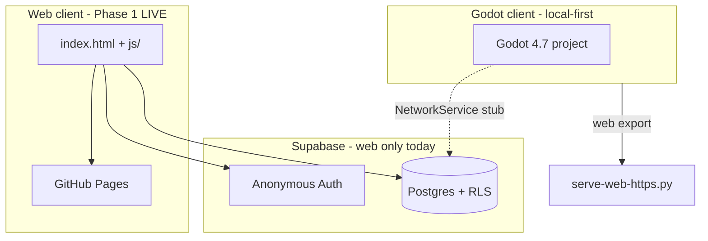

# Creature

Tamagotchi-style multiplayer creature field. Players spawn a customizable blob, wander a shared map, fight, eat, sleep, and see each other in real time (web) or against local AI (Godot).

**Design source of truth (local, gitignored):** `_first.txt` — full product vision, Supabase project ref, and credentials (never commit).

**Live web build:** [https://melqudsi.github.io/Creature/](https://melqudsi.github.io/Creature/)  
**GitHub:** [https://github.com/melqudsi/Creature](https://github.com/melqudsi/Creature)

---

## Architecture (two clients, one backend)



| Client | Path | Multiplayer | Visual style | Status |
|--------|------|-------------|--------------|--------|
| **Web** | repo root (`index.html`, `js/`, `css/`) | Supabase REST + 1.5s polling | Stardew-like top-down 2D canvas | **Deployed**, playable online |
| **Godot** | `creature-godot/` | Local only (`NetworkService` stub) | SC2-inspired 3D RTS | **Playable** in editor + web export |

Godot is **not** connected to the live Supabase world yet. Web and Godot share gameplay constants but are separate codebases.

---

## Repository layout

```
Creature/
├── index.html, css/, js/          # Web game (Phase 1)
│   ├── main.js                    # Boot, auth, screens
│   ├── game.js                    # Simulation, camera, combat
│   ├── api.js                     # Supabase client
│   ├── renderer.js, eyes.js       # Drawing
│   └── config.example.js          # Publishable key (committed for Pages)
├── supabase/schema.sql            # Tables + RLS policies
├── docs/supabase-multiplayer-guide.md
├── start-server.ps1               # LAN dev server for web (prints Wi‑Fi URL)
├── creature-godot/                # Godot 4.7 project (separate game)
│   ├── project.godot
│   ├── scenes/, scripts/
│   ├── web/                       # Godot HTML5 export output
│   ├── serve-web-https.py         # HTTPS server for web export (required for LAN/phone)
│   ├── serve-web.py               # HTTP localhost only
│   ├── export_presets.cfg         # PWA enabled for future exports
│   └── docs/godot-porting-notes.md
└── README.md                      # This file
```

**Gitignored:** `js/config.js`, `_first.txt`, `.env`, `creature-godot/.godot/`, `creature-godot/web-certs/`

---

## Shared gameplay rules

Ported from web `js/game.js` and Godot `scripts/config.gd` (`GameConfig`):

| Rule | Value |
|------|-------|
| Map | 20×15 tiles, 6 trees (positions in `schema.sql` / `GameConfig.TREE_POSITIONS`) |
| Move speed | 1 tile/sec, 1 stamina per tile |
| Stamina | Max 10, regen 1/sec when idle (web + Godot) |
| Fight | Range 1.2, 15 damage, 2 stamina |
| Eat | Range 1.1, must be bigger (`size_level`), +1 size |
| AFK sleep | 45s → asleep, slight shrink |
| Name | Max 10 chars, cute or ugly appearance, 6 colors |

**Web-only extras:** follow camera, tap-to-move, mobile fullscreen CSS, player name hidden above own creature, sleep Zzz animation.

**Godot-only:** SC2 HUD (minimap, command panel, portrait), 3 AI creatures (Grunk, Mimi, Blorp), right-click move, RTS camera pan/zoom.

---

## Web client (Phase 1)

### Supabase setup (required once)

1. Dashboard → **Authentication → Anonymous sign-ins → ON → Save** (Save is mandatory).
2. SQL Editor → run [`supabase/schema.sql`](supabase/schema.sql).
3. **Do not** enable Realtime/replication unless you switch from polling to websockets (see [multiplayer guide](docs/supabase-multiplayer-guide.md)).

Keys: `js/config.example.js` (committed). `api.js` imports it. Publishable key only — never commit DB password.

### Run locally

```powershell
# Web (ES modules need a static server)
.\start-server.ps1
# or: python -m http.server 3456 --bind 0.0.0.0
```

- Desktop: `http://localhost:3456`
- Phone (Wi‑Fi): `http://<wifi-ip>:3456` (e.g. `192.168.1.x` — **not** Ethernet `10.x` if phone is on Wi‑Fi)

### Deploy

GitHub Pages from `main` / root. Config is in-repo via `config.example.js`.

### Key files for agents

| File | Role |
|------|------|
| [`js/api.js`](js/api.js) | All Supabase calls |
| [`js/game.js`](js/game.js) | Game loop, movement, combat, camera, polling |
| [`js/main.js`](js/main.js) | Auth boot, create flow, error messages |
| [`supabase/schema.sql`](supabase/schema.sql) | DB schema + RLS |

### Known web issues / notes

- Fight updates **another player's row** — RLS may need an RPC for production (documented in multiplayer guide).
- Multiplayer sync is **poll-based** (~1.5s), not Realtime (free-tier friendly).

---

## Godot client (`creature-godot/`)

Godot **4.7+**, Forward+. Main scene: `scenes/ui/creature_create.tscn` → `scenes/main.tscn`.

### Run in editor

Open `creature-godot/project.godot` → F5.

### Web export

Export preset **Web** → output `web/`. Godot wasm builds **require a secure context**:

| URL | Works? |
|-----|--------|
| `http://localhost:8080` | Yes (desktop only) |
| `http://192.168.x.x` | **No** — “Secure Context” error |
| `https://192.168.x.x:8443` | Yes (phone/LAN) |

```powershell
cd creature-godot
python serve-web-https.py   # HTTPS on 8443, self-signed cert in web-certs/
```

### Mobile: fullscreen + PWA

- After load, tap **“Tap for fullscreen”** on the overlay (`web/index.html`).
- **PWA (recommended):** `web/manifest.webmanifest` + `web/sw.js` — Add to Home Screen for app-like fullscreen + landscape.
- **Re-export warning:** Godot overwrites `web/index.html` on export. PWA manifest/service worker survive; re-merge HTML changes or set **custom HTML shell** in export settings later (`export_presets.cfg` has PWA enabled for future exports).

### Godot typing (4.7)

Use `class_name Creature` and typed references — generic `Node3D` + `grid_pos` causes “Cannot infer type” errors. See `scripts/units/creature.gd`.

### Key files for agents

| File | Role |
|------|------|
| [`scripts/autoload/game_state.gd`](creature-godot/scripts/autoload/game_state.gd) | Local sim, AI spawn, fight/eat |
| [`scripts/autoload/network_service.gd`](creature-godot/scripts/autoload/network_service.gd) | Supabase stub (Phase 5) |
| [`scripts/units/creature.gd`](creature-godot/scripts/units/creature.gd) | Unit logic |
| [`scripts/config.gd`](creature-godot/scripts/config.gd) | Shared constants |
| [`docs/godot-porting-notes.md`](creature-godot/docs/godot-porting-notes.md) | Web ↔ Godot file map |

Details: [`creature-godot/README.md`](creature-godot/README.md)

---

## Phase 2 / not implemented

From `_first.txt` and plan — **do not assume these exist:**

- [ ] Godot ↔ Supabase shared multiplayer (wire `NetworkService` HTTP)
- [ ] Passkey / persistent creature identity across sessions
- [ ] Visual HP/stamina on creatures (hide bars)
- [ ] Shared world: web players + Godot players together
- [ ] Custom Godot HTML shell so PWA/fullscreen survives re-export
- [ ] Eat/fight RLS hardening (Postgres RPC)
- [ ] Map expansion, ability system after eating

---

## Agent handoff checklist

**To work on web multiplayer:**

1. Read [`docs/supabase-multiplayer-guide.md`](docs/supabase-multiplayer-guide.md).
2. Confirm anonymous auth + schema applied.
3. Test with two browser sessions (normal + incognito).
4. Constants live in `js/game.js`; API surface in `js/api.js`.

**To work on Godot:**

1. Read [`creature-godot/docs/godot-porting-notes.md`](creature-godot/docs/godot-porting-notes.md).
2. Editor test first; web export second (always HTTPS for LAN).
3. `NetworkService` is the seam for Supabase — mirror `js/api.js` methods.
4. After Godot re-export, diff `web/index.html` against git for PWA/fullscreen JS.

**To test phone:**

- Web game: Wi‑Fi IP + HTTP port 3456 + firewall.
- Godot web: Wi‑Fi IP + **HTTPS** port 8443 + accept cert + optional PWA install.

**Machine context (dev PC):** hostname `GamePc2`; typical IPs — Wi‑Fi `192.168.1.26`, Ethernet `10.5.0.2`. Phones must use the **Wi‑Fi** address.

---

## Controls (web)

| Input | Action |
|-------|--------|
| WASD / arrows | Move |
| Tap map | Move to tile |
| F | Fight |
| E | Eat (when bigger) |

AFK ~45s or hidden tab → sleep. Eaten players see toast on return.

## Controls (Godot)

Right-click move · F/E fight/eat · WASD / edge pan · scroll zoom. See godot README.

---

## Security

- Browser/client: **publishable key only** (`sb_publishable_…` in `config.example.js`).
- Postgres password and secrets belong in `_first.txt` (gitignored) or local env — **never commit**.
- `creature-godot/web-certs/` is dev-only self-signed HTTPS.

---

## Further reading

- [Supabase multiplayer pattern](docs/supabase-multiplayer-guide.md) — auth, polling, RLS, how to port to other games
- [Godot porting notes](creature-godot/docs/godot-porting-notes.md) — file mapping and Phase 5 HTTP plan
