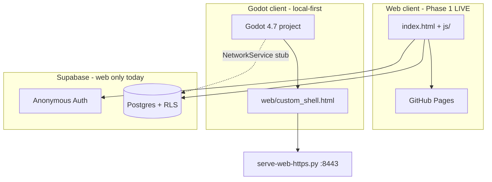

# Creature

Tamagotchi-style multiplayer creature field. Players spawn a customizable blob and wander a shared map.

**Design source of truth (local, gitignored):** `_first.txt` — full product vision, Supabase project ref, and credentials (never commit).

**Live web build:** [https://melqudsi.github.io/Creature/](https://melqudsi.github.io/Creature/)  
**GitHub:** [https://github.com/melqudsi/Creature](https://github.com/melqudsi/Creature)

---

## Architecture (two clients, one backend)



| Client | Path | Multiplayer | Visual style | Status |
|--------|------|-------------|--------------|--------|
| **Web** | repo root (`index.html`, `js/`, `css/`) | Supabase REST + 1.5s polling | Stardew-like top-down 2D canvas | **Deployed**, full gameplay (fight/eat/sleep) |
| **Godot** | `creature-godot/` | Local only (`NetworkService` stub) | SC2-inspired 3D RTS | **Spawn + move** in editor and web export |

Godot is **not** connected to the live Supabase world. Web and Godot share map/movement constants but are separate codebases with different feature sets.

---

## Repository layout

```
Creature/
├── index.html, css/, js/              # Web game (Phase 1 — complete)
├── supabase/schema.sql
├── docs/supabase-multiplayer-guide.md
├── start-server.ps1                   # Web LAN dev (port 3456)
├── creature-godot/                    # Godot 4.7 project
│   ├── project.godot
│   ├── scenes/, scripts/
│   ├── web/
│   │   ├── custom_shell.html          # Edit this — survives re-export
│   │   ├── index.html                 # Godot export output (generated)
│   │   ├── manifest.webmanifest       # PWA manifest (manual)
│   │   └── index.service.worker.js    # Godot PWA SW (generated on export)
│   ├── serve-web-https.py             # Phone/LAN testing (port 8443)
│   ├── serve-web.py                   # Desktop localhost (port 8080)
│   ├── export_presets.cfg
│   └── docs/godot-porting-notes.md
└── README.md
```

**Gitignored:** `js/config.js`, `_first.txt`, `.env`, `creature-godot/.godot/`, `creature-godot/web-certs/`

---

## Shared gameplay rules

Constants in web `js/game.js` and Godot `scripts/config.gd` (`GameConfig`):

| Rule | Value |
|------|-------|
| Map | 20×15 tiles, 6 trees |
| Move speed | 1 tile/sec, 1 stamina per tile |
| Stamina | Max 10, regen 1/sec when idle |
| AFK sleep | 45s → asleep |
| Name | Max 10 chars, cute/ugly, 6 colors |

**Web only (live):** fight, eat, grow, multiplayer polling, follow camera, tap-to-move.

**Godot only (current scope):** boot straight into map with a default dark-gray worm. **Fluid movement** in any direction with **A\*** pathfinding around trees/units. Tap/click ground to move, pinch/wheel zoom, WASD/edge pan. Top stat bar + **pain test** stress button (dev). No customization screen, fight, eat, or persistent AI.

---

## Web client (Phase 1 — complete)

### Supabase setup (required once)

1. Dashboard → **Authentication → Anonymous sign-ins → ON → Save** (Save is mandatory).
2. SQL Editor → run [`supabase/schema.sql`](supabase/schema.sql).
3. **Do not** enable Realtime/replication (game uses REST polling ~1.5s).

Keys: `js/config.example.js` (committed for GitHub Pages). Publishable key only.

### Run locally

```powershell
.\start-server.ps1
# Desktop: http://localhost:3456
# Phone (Wi‑Fi): http://<wifi-ip>:3456  (not Ethernet 10.x if phone is on Wi‑Fi)
```

### Key files

| File | Role |
|------|------|
| [`js/api.js`](js/api.js) | Supabase client |
| [`js/game.js`](js/game.js) | Game loop, combat, camera, polling |
| [`js/main.js`](js/main.js) | Auth, create flow |
| [`supabase/schema.sql`](supabase/schema.sql) | Schema + RLS |

### Known web issues

- Fight may need Postgres RPC for cross-player HP updates (see multiplayer guide).
- Poll-based sync (~1.5s), not Realtime.

---

## Godot client (`creature-godot/`)

Godot **4.7+**, Forward+. **Boot flow:** `project.godot` → `run/main_scene = res://scenes/main.tscn` (no create screen). `GameState._ready()` loads `GameConfig.default_player_data()`; `world_map.gd` spawns the player worm at map center.

### Current feature set

| Feature | Status |
|---------|--------|
| Default worm creature (dark gray, procedural mesh) | Done |
| Fluid movement (any angle, not grid-locked 90° turns) | Done |
| A* pathfinding around trees and other units | Done |
| Tap/click ground to move | Done (mobile + desktop) |
| Pinch / wheel zoom (scales camera offset, not just height) | Done |
| Top stat bar (name, HP, stamina) | Done |
| Pain test stress button (20 wanderers + 50 props, 30s) | Done |
| Creature create / customization | **Bypassed** (`creature_create.tscn` still in repo, unused) |
| Fight / eat | **Removed** |
| Persistent AI creatures | **Removed** (pain test spawns temporary wanderers) |
| Minimap, portrait panel | **Removed** |
| Per-creature health bar above unit | Hidden (was briefly visible due to `_ready`/`setup` order — fixed) |
| Supabase multiplayer | Not started (`NetworkService` stub) |

### Worm mesh (important for agents)

Procedural body in [`scripts/units/creature.gd`](creature-godot/scripts/units/creature.gd):

- Five overlapping `CapsuleMesh` segments on `$Body`, laid **horizontally along local +Z** (head at front)
- Each segment: `rotation_degrees = Vector3(90, 0, 0)` so capsule length runs forward; `position.y = radius * 0.92` so belly sits on ground
- **`body_root` must stay at zero rotation** — do not rotate the whole body 90° on X; that stacks segment Z positions into world Y and looks like a vertical “snowman”
- Tiny emissive eye spheres on the head; slither wiggle in `_apply_slither()`
- Appearance is always `"worm"`; color from `GameConfig.DEFAULT_CREATURE_COLOR` (~`Color(0.22, 0.22, 0.26)`)

To tune the silhouette, edit `SEGMENT_SPECS` (z spacing, radius, length overlap) — not the scene file.

### Movement and pathfinding

- **Continuous movement** in [`scripts/units/creature.gd`](creature-godot/scripts/units/creature.gd): creature glides toward waypoints at any angle; rotation lerps toward travel direction
- **A\*** in [`scripts/world/grid_nav.gd`](creature-godot/scripts/world/grid_nav.gd): 8-directional path around `GameState.blocked_tiles` (trees) and other units; line-of-sight path simplification removes extra corners
- Click while moving replans from current position
- Stamina still costs 1 per tile of distance traveled (fractional tracking on diagonals)

### Mobile stress test (“pain test”)

Top-right HUD button in [`scripts/ui/sc2_hud.gd`](creature-godot/scripts/ui/sc2_hud.gd), logic in [`scripts/debug/pain_test.gd`](creature-godot/scripts/debug/pain_test.gd):

- Spawns **20** temporary wandering worms + **50** random props (cubes, spheres, pyramids, cylinders)
- Auto-despawns after **30 seconds**
- Use on phone after web export to gauge FPS / input lag; pair with Godot **Profiler → Monitors** for deeper analysis
- `main.gd` blocks ground taps over the button rect so it works on touch web

### Key files for agents

| File | Role |
|------|------|
| [`project.godot`](creature-godot/project.godot) | Main scene = `scenes/main.tscn`; touch → emulated mouse |
| [`scripts/config.gd`](creature-godot/scripts/config.gd) | Shared constants + `default_player_data()` |
| [`scripts/autoload/game_state.gd`](creature-godot/scripts/autoload/game_state.gd) | Player data, creature registry, stamina/AFK |
| [`scripts/main.gd`](creature-godot/scripts/main.gd) | Boots world, forwards pointer input to camera |
| [`scripts/camera/rts_camera.gd`](creature-godot/scripts/camera/rts_camera.gd) | Tap-to-move, pinch zoom, raycast; `_camera_offset()` scales full 3D offset by `_desired_distance` |
| [`scripts/units/creature.gd`](creature-godot/scripts/units/creature.gd) | Worm mesh, fluid path movement, health bar (hidden) |
| [`scripts/world/grid_nav.gd`](creature-godot/scripts/world/grid_nav.gd) | A* pathfinding, obstacle avoidance |
| [`scripts/world/world_map.gd`](creature-godot/scripts/world/world_map.gd) | Terrain, ground collision, player spawn, click marker |
| [`scripts/ui/sc2_hud.gd`](creature-godot/scripts/ui/sc2_hud.gd) | Top bar + pain test button |
| [`scripts/debug/pain_test.gd`](creature-godot/scripts/debug/pain_test.gd) | Mobile stress test spawner |
| [`scripts/autoload/network_service.gd`](creature-godot/scripts/autoload/network_service.gd) | Supabase seam (stub) |
| [`web/custom_shell.html`](creature-godot/web/custom_shell.html) | PWA shell, dev mode, mobile fullscreen |
| [`export_presets.cfg`](creature-godot/export_presets.cfg) | Web export preset |

Legacy (unused in current boot flow): [`scripts/ui/creature_create.gd`](creature-godot/scripts/ui/creature_create.gd), [`scenes/ui/creature_create.tscn`](creature-godot/scenes/ui/creature_create.tscn).

Details: [`creature-godot/README.md`](creature-godot/README.md)

### Run in editor

Open `creature-godot/project.godot` → **F5**.

### Web export workflow

1. **Project → Export…** → preset **Web**
2. Confirm **Custom Html Shell** = `res://web/custom_shell.html`
3. Export to `creature-godot/web/index.html` (overwrite)
4. **Never hand-edit `index.html`** — edit `custom_shell.html` instead

| Export setting | Value | Why |
|----------------|-------|-----|
| Custom HTML shell | `res://web/custom_shell.html` | PWA, dev mode, mobile UI survive export |
| Experimental virtual keyboard | On | Name field on mobile web |
| Focus canvas on start | Off | UI text fields work |
| PWA | On | Add to Home Screen |

### Serve and test on phone

Godot wasm **requires HTTPS** off localhost:

```powershell
cd creature-godot
python serve-web-https.py
# Phone: https://<wifi-ip>:8443/  (accept self-signed cert)
```

| URL | Works? |
|-----|--------|
| `http://localhost:8080` | Desktop only (`serve-web.py`) |
| `http://192.168.x.x` | **No** — Secure Context error |
| `https://192.168.x.x:8443` | Yes |

### Dev mode (no incognito / clear site data)

On ports **8443** and **8080**, `custom_shell.html` auto-enables **dev mode**:

- Unregisters service workers
- Clears cached wasm/pck
- Disables Godot PWA service worker for that session

**Re-export → refresh** is enough for local testing.

| URL flag | Effect |
|----------|--------|
| (default on `:8443` / `:8080`) | Dev mode on |
| `?dev=1` | Force dev mode on any host |
| `?dev=0` | Force service workers on (test PWA caching) |

**Installed PWA:** after re-export, fully close app and reopen, or pull-to-refresh.

### Mobile input (implemented — important for agents)

Touch handling lives in `rts_camera.gd` + input forwarding in `main.gd`:

- **Tap to move:** finger-down on single touch + mouse click fallback; uses viewport coordinate correction for touch
- **Pinch zoom:** two-finger distance tracking in `process_pointer_input()`
- **Input routing:** `main.gd` `_input` + `_unhandled_input` → `rts_camera.process_pointer_input()`
- **Ground pick:** physics raycast on `StaticBody3D` ground collider, plane fallback
- **Click marker:** brief flash via `world_map.show_click_marker()` confirms tap registered
- **Project setting:** `input_devices/pointing/emulate_mouse_from_touch=true` (touch also arrives as emulated mouse; debounced)

**Spawn screen (legacy):** `creature_create.gd` still exists if customization is re-enabled. On web it calls `DisplayServer.virtual_keyboard_show()` — do **not** use `DisplayServer.VIRTUAL_KEYBOARD_TYPE_DEFAULT` (Godot 4.7 compile error). Preview creature uses `setup.call_deferred()` and id `"preview"` to skip grid registration.

### Mobile fullscreen / PWA

- Browser: tap **“Tap to start”** banner (dismisses even if iOS blocks true fullscreen API)
- **Add to Home Screen** recommended for iPhone fullscreen (Safari cannot fullscreen canvas in-browser)
- PWA manifest: `web/manifest.webmanifest` (`fullscreen`, `landscape`)

### Godot 4.7 typing

Use `class_name Creature` and typed references. Generic `Node3D` + `grid_pos` causes inference errors.

---

## Phase 2 / not implemented

- [ ] Godot ↔ Supabase shared multiplayer (wire `NetworkService` HTTP)
- [ ] Re-add fight/eat to Godot (removed intentionally for now)
- [ ] Re-enable creature customization / create screen (scene still in repo)
- [ ] Passkey / persistent creature identity
- [ ] Shared world: web + Godot players together
- [ ] Eat/fight RLS hardening on web (Postgres RPC)
- [ ] Map expansion, ability system

**Done since initial handoff:**

- [x] Godot custom HTML shell (`web/custom_shell.html`)
- [x] Mobile tap-to-move + pinch zoom on Godot web
- [x] Dev mode to avoid clearing site data between exports
- [x] Simplified Godot HUD (spawn + move only)
- [x] Removed customization — boot straight into map with default worm
- [x] Camera zoom scales full offset toward subject (not just lowering camera)
- [x] Horizontal worm mesh (capsule segments along ground; fixed “snowman” stacking bug)
- [x] Player health bar hidden above creature
- [x] Fluid any-direction movement with A* pathfinding around obstacles
- [x] Pain test HUD button for 30s mobile stress test

---

## Agent handoff checklist

### Web multiplayer

1. Read [`docs/supabase-multiplayer-guide.md`](docs/supabase-multiplayer-guide.md)
2. Confirm anonymous auth + schema applied
3. Test two browser sessions (normal + incognito)
4. Constants: `js/game.js`; API: `js/api.js`

### Godot

1. Read [`creature-godot/docs/godot-porting-notes.md`](creature-godot/docs/godot-porting-notes.md)
2. **F5 in editor first** — main scene spawns default worm at map center (no create screen)
3. Worm look → `scripts/units/creature.gd` (`SEGMENT_SPECS`, per-segment `SEGMENT_ROT`; do not rotate `body_root` 90° on X)
4. Movement/pathing → `scripts/units/creature.gd`, `scripts/world/grid_nav.gd`
5. Defaults → `scripts/config.gd` (`default_player_data()`), spawn → `scripts/world/world_map.gd`
6. Mobile perf → export web, tap **pain test**, watch FPS; use Godot Profiler for details
7. Then web export + `serve-web-https.py` for phone testing
8. Edit `web/custom_shell.html` for HTML/JS changes — re-export to apply
9. Touch/zoom → `scripts/camera/rts_camera.gd`, `scripts/main.gd`
10. `NetworkService` is the Supabase seam — mirror `js/api.js`

### Phone testing

| Client | URL | Notes |
|--------|-----|-------|
| Web | `http://<wifi-ip>:3456` | HTTP OK; firewall port 3456 |
| Godot | `https://<wifi-ip>:8443` | HTTPS required; firewall port 8443 |

**Dev PC:** hostname `GamePc2`; Wi‑Fi typically `192.168.1.26`, Ethernet `10.5.0.2` — phones use **Wi‑Fi IP**.

### Common gotchas

1. Supabase anonymous toggle must be **saved** or auth fails
2. Godot web on LAN **must be HTTPS** (not `http://192.168.x.x`)
3. Godot compile error if wrong `DisplayServer` keyboard enum — breaks entire spawn screen script
4. Service workers cache old wasm/pck — use dev server ports or `?dev=1`
5. iOS browser fullscreen API does not work for canvas — use PWA Add to Home Screen
6. Worm looked like stacked spheres (“snowman”) if `body_root.rotation_degrees = Vector3(90,0,0)` — segments must be rotated individually, body root stays at zero
7. Green rectangle above player was the health bar showing before `setup()` — keep `health_bar.visible = false` for player
8. `_first.txt` and Postgres password — never commit

---

## Controls

### Web

| Input | Action |
|-------|--------|
| WASD / arrows | Move |
| Tap map | Move |
| F / E | Fight / eat |

### Godot

| Input | Action |
|-------|--------|
| Tap / click ground | Move |
| **pain test** (top-right) | 30s stress test |
| Pinch / mouse wheel | Zoom |
| WASD / screen edge | Pan camera |

---

## Security

- Browser: **publishable key only** (`config.example.js`)
- Secrets in `_first.txt` (gitignored) or local env — never commit
- `creature-godot/web-certs/` is dev-only self-signed TLS

---

## Further reading

- [Supabase multiplayer pattern](docs/supabase-multiplayer-guide.md)
- [Godot porting notes](creature-godot/docs/godot-porting-notes.md)
- [Godot client README](creature-godot/README.md) — export steps, dev mode, PWA
