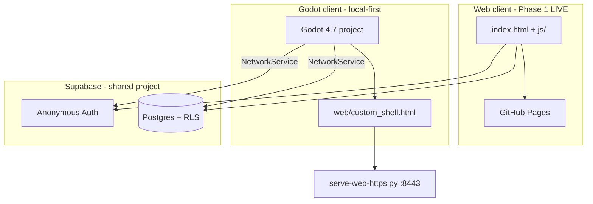

# Creature

Multiplayer **alien shapeshifting** sandbox (pivot). Players spawn as aliens at a landfill, shapeshift into Memphis world objects (Rusty Altima, Magnolia Tree, Pothole, Propane Tank…), and kill/counter each other in funny ways. The old Tamagotchi creature field is the technical base being pivoted from.

> **📄 GAME DESIGN — READ FIRST:** the authoritative design is the PDF in the repo root: **`Multiplayer Alien Shapeshifting Prototype.pdf`**. It defines the pitch, forms, the kill/collision matrix, the money system, shapeshift rules, and the phased build order. Future agents should read it before changing gameplay. (`_moe_brainstorming.txt` holds looser notes.)

**Design source of truth (local, gitignored):** `_first.txt` — full product vision, Supabase project ref, and credentials (never commit).

---

## Slice 1 — shapeshifting prototype

The Phase-1 fun loop from the PDF is built in the Godot client:

- **Forms & shapeshifting** — `alien` (default worm) plus `altima`, `magnolia_tree`, `pothole`, `propane_tank`. Stand near an interactive object → **Become** (1s hold) → your body becomes that object with its speed/collision/kill rules. **Pop Out** returns you to alien and drops the object where you're standing. Forms are defined centrally in [`creature-godot/scripts/forms/form_defs.gd`](creature-godot/scripts/forms/form_defs.gd); shared procedural meshes in [`scripts/forms/object_mesh.gd`](creature-godot/scripts/forms/object_mesh.gd). A shapeshifted form renders at the **same 1:1 size** as its source world prop.
- **Landfill Dump** — spawn/respawn zone (bottom-left) with starter junk. `GameConfig.LANDFILL_RECT` / `LANDFILL_CENTER`.
- **Kill/collision matrix** — Altima squishes aliens; tree/pothole/building/propane wreck an Altima; propane explodes (bright, visible blast + light) with a lethal radius. Death shows a funny line and respawns you at the dump. **Kills are CLIENT-LOCAL:** each client only ever decides whether *its own* player dies (remote blast damage is not synced in Slice 1).
- **World-object shared state (Supabase)** — interactive objects live in a shared `public.world_objects` table so all clients agree on them. Becoming an object marks it `possessed` (hidden as a standalone prop for everyone → no duplicate); popping out releases it `idle` at your current spot so it **persists for everyone, even across disconnect**. The client **degrades gracefully** if the table doesn't exist yet (falls back to client-local placement, logs a notice).
- **Form sync** — `creatures.form` column syncs each player's current form so others see your Altima/tree/etc.
- **Region label** — bottom-left HUD label shows the current region (**"The Dump"** in the landfill, **"Memphis"** elsewhere); extend `GameConfig.region_for_tile()` for new regions.
- **Toasts** — shapeshift/death/status messages appear as a **top banner** (out of the way).

### Required Supabase migrations

Run in the Supabase SQL Editor (Dashboard → SQL → New query):

| Migration | Purpose | Status |
|-----------|---------|--------|
| [`supabase/schema.sql`](supabase/schema.sql) | Base tables + RLS (now also includes `world_objects`) | applied |
| [`supabase/migration-temp-profile-admin.sql`](supabase/migration-temp-profile-admin.sql) | Temp name-claim + admin delete | applied |
| [`supabase/migration-forms.sql`](supabase/migration-forms.sql) | Adds `creatures.form` (form sync) | **applied** |
| [`supabase/migration-world-objects.sql`](supabase/migration-world-objects.sql) | Adds `public.world_objects` (shared/persistent interactive objects) | **applied** |
| [`supabase/migration-money.sql`](supabase/migration-money.sql) | Adds `world_objects.owner_name` (Slice 2 money labels) | **RUN for owner labels** |

Until `migration-world-objects.sql` is run, interactive objects stay client-local (no cross-player sync / persistence), but the game still works.

---

## Slice 2 — money system (current)

The Phase-2 economy loop from the PDF is implemented in the Godot client:

- **Money tiers** — `money_stack` → combine → `money_bag` → combine → `vault`. Stacks/bags/vaults are shared `world_objects` rows (same table as interactive props).
- **Pick up / drop** — HUD **Pick Up** / **Drop** buttons (shown when eligible). Carry rules depend on your form (alien: one stack or bag; cart: up to 4 stacks or one bag; Altima: 3 stacks or one bag; MATA Bus: up to 3 bags or one vault).
- **Combine** — dropping matching tiers close together merges them client-side (green sparkle FX); creates a new shared row when online.
- **Ownership labels** — bags/vaults show `"MOE's Money Bag"` etc. Requires `owner_name` column (`migration-money.sql`).
- **Stealing (claim zone)** — haul someone else's bag/vault into the landfill and drop to claim it.
- **Death drop** — carried money falls at your death tile (no auto-combine).
- **New shapeshift forms** — **Shopping Cart** (`cart` prop) and **MATA Bus** (`bus` prop). Bus is slower but can haul vaults.

The client **degrades gracefully** without `owner_name` (money still works; labels just won't persist). Existing worlds auto-seed money stacks + bus on first poll if missing (no wipe).

**Live web build:** [https://melqudsi.github.io/Creature/](https://melqudsi.github.io/Creature/)  
**GitHub:** [https://github.com/melqudsi/Creature](https://github.com/melqudsi/Creature)

---

## Slice 2 — Money system (Steps 3 & 4 of the PDF)

Physical, persistent, synced **money** plus the two **transport forms**. Money objects reuse the same `public.world_objects` table as Slice 1 — they're just new `type` values (`money_stack`, `money_bag`, `vault`), so no new table is needed.

- **Three money tiers** — **Money Stack** (T1), **Money Bag** (T2), **Vault** (T3), each with a distinct procedural mesh (`ObjectMesh`). Seeded around the landfill + neighborhood (stacks) and the new **Bus Stop** (bags), so there's money to grab immediately.
- **Pick up / drop** — HUD **Pick Up** grabs the nearest eligible money in reach; **Drop** sets everything down at your tile. Carried money floats attached to your model and makes you **heavier/slower** (bigger tiers = bigger slowdown). Capacity/eligibility is per form, with a clear toast when refused (e.g. *"Alien can't carry a vault"*).
- **Per-form carrying** — **Alien**: one stack, or one bag (slowly). **Shopping Cart** (new form): several stacks or one bag, faster than alien / slower than Altima, can't kill. **Altima**: several stacks or one bag. **MATA Bus** (new form): several bags **and one vault**.
- **Combining** — dropping two matching-tier money objects close together merges them (**Stack + Stack = Bag**, **Bag + Bag = Vault**) with a gold combine sparkle; the combining player becomes the owner.
- **Ownership + stealing** — bags/vaults show a floating **"NAME's Money Bag / Vault"** label when you're near. Carry someone else's bag/vault into a **claim zone** (the Landfill Dump) and drop it to **steal ownership** (label updates to you). Money stacks stay ownerless.
- **Drop on death** — dying scatters all carried money at the death spot as idle, synced objects (then you respawn at the landfill as Alien) — the core of the revenge/steal loop.
- **New kill-matrix rows** — the **MATA Bus** crushes **Alien / Altima / Shopping Cart**; the bus dies at buildings and to propane explosions; explosions now also kill carts and the bus. Shopping carts are squished by Altima/Bus.

**Client-local authority (known limitation):** combining, stealing/claiming and kills are all decided on the acting player's client (like Slice 1 kills), so two players combining/claiming the same money at the exact same instant can race. Fine for the prototype; a server-authoritative pass is deferred.

**Supabase — one migration to run:** [`supabase/migration-money.sql`](supabase/migration-money.sql) adds a single column, `world_objects.owner_name`, for the persistent bag/vault owner labels. **Everything else degrades gracefully without it** — money can still be collected, carried, combined, dropped and stolen (carried money reuses the existing `state='carried'` + `possessed_by` columns; a fresh/pre-Slice-2 world is auto-topped-up with the money + bus objects on first poll). Without the column, bags/vaults just show a generic label and owner names don't persist across clients.

---

## Architecture (two clients, one backend)



| Client | Path | Multiplayer | Visual style | Status |
|--------|------|-------------|--------------|--------|
| **Web** | repo root (`index.html`, `js/`, `css/`) | Supabase REST + 1.5s polling | Stardew-like top-down 2D canvas | **Deployed**, full gameplay (fight/eat/sleep) |
| **Godot** | `creature-godot/` | Supabase session + position save + **1.5s poll for other players** | SC2-inspired 3D RTS | **Spawn + move + cloud save + live field** in editor and web export |

Godot shares the Supabase **project** with the web client and polls the same `creatures` table (~1.5s) to show other players as remote worms. Web and Godot are separate codebases pivoting toward a new game direction.

---

## Repository layout

```
Creature/
├── index.html, css/, js/              # Web game (Phase 1 — complete)
├── supabase/schema.sql
├── supabase/migration-godot-session.sql  # Optional: allow appearance=worm in DB
├── docs/supabase-multiplayer-guide.md
├── start-server.ps1                   # Web LAN dev (port 3456)
├── creature-godot/                    # Godot 4.7 project
│   ├── project.godot
│   ├── scenes/, scripts/
│   ├── web/
│   │   ├── custom_shell.html          # Edit this — survives re-export
│   │   ├── index.html                 # Godot export output (generated)
│   │   ├── manifest.webmanifest       # PWA manifest (manual)
│   │   └── index.service.worker.js    # Godot PWA SW (generated on export)
│   ├── serve-web-https.py             # Phone/LAN testing (port 8443)
│   ├── serve-web.py                   # Desktop localhost (port 8080)
│   ├── export_presets.cfg
│   └── docs/godot-porting-notes.md
└── README.md
```

**Gitignored:** `js/config.js`, `_first.txt`, `.env`, `creature-godot/.godot/`, `creature-godot/web-certs/`

---

## Shared gameplay rules

Constants in web `js/game.js` and Godot `scripts/config.gd` (`GameConfig`):

| Rule | Value |
|------|-------|
| Map | 32×24 tiles, 16 trees, 6 buildings |
| Move speed | 1 tile/sec (Godot); web also has stamina rules |
| Name | Max 10 chars |

**Web only (live):** fight, eat, stamina, AFK sleep, grow, multiplayer polling, follow camera, tap-to-move.

**Godot only (current scope):** redesigned onboarding spawn screen (uppercase name + color palette, no 3D preview), default worm with **idle rest animations** (local "breathing", remote "sway"), **fluid A\*** movement, tap/click + pinch zoom, **Supabase session save** (restore last profile on return), **other players visible** via REST poll with stable randomized facing. Camera **starts fully zoomed in**. Top bar shows name only — **health/stamina removed**. Admin panel (visible only to player `MOE`) contains configurable pain test, profile deletion, readable logs, and a clear-session/reload button. Player names are forced **UPPERCASE** (dedupes case-variant profiles). No fight, eat, or persistent AI.

---

## Web client (Phase 1 — complete)

### Supabase setup (required once)

1. Dashboard → **Authentication → Anonymous sign-ins → ON → Save** (Save is mandatory).
2. SQL Editor → run [`supabase/schema.sql`](supabase/schema.sql).
3. **Do not** enable Realtime/replication (game uses REST polling ~1.5s).

Keys: `js/config.example.js` (committed for GitHub Pages). Publishable key only.

### Run locally

```powershell
.\start-server.ps1
# Desktop: http://localhost:3456
# Phone (Wi‑Fi): http://<wifi-ip>:3456  (not Ethernet 10.x if phone is on Wi‑Fi)
```

### Key files

| File | Role |
|------|------|
| [`js/api.js`](js/api.js) | Supabase client |
| [`js/game.js`](js/game.js) | Game loop, combat, camera, polling |
| [`js/main.js`](js/main.js) | Auth, create flow |
| [`supabase/schema.sql`](supabase/schema.sql) | Schema + RLS |

### Known web issues

- Fight may need Postgres RPC for cross-player HP updates (see multiplayer guide).
- Poll-based sync (~1.5s), not Realtime.

---

## Godot client (`creature-godot/`)

Godot **4.7+**, Forward+. **Boot flow:** `main.gd` → `await NetworkService.boot()` (auth + load existing session profile) → onboarding if no profile, otherwise `_begin_world()` → `world_map.spawn_player()` at saved `x,y`.

> **Engine-virtual naming gotcha (critical):** the world-entry method is `_begin_world()`, **not** `_enter_world()`. `_enter_world` is a Godot 4.7 `Node3D` engine virtual — the engine auto-invokes it on tree entry, *before* boot/onboarding, which previously spawned a default gray creature, set the `_world_started` guard, and left the HUD hidden (root cause of "creature stuck gray" + "HUD missing for new player"). **Never name your own methods after engine virtuals** (`_ready`, `_process`, `_enter_world`, `_exit_world`, `_input`, etc.) unless you intend to override them.

### Current feature set

| Feature | Status |
|---------|--------|
| Default worm creature (dark gray, procedural mesh) | Done |
| Fluid movement + A* pathfinding | Done |
| Idle rest animations (local "breathing" vs remote "sway") | Done |
| Randomized-but-stable facing for remote players | Done |
| Tap/click ground to move (mobile + desktop) | Done |
| Pinch / wheel zoom | Done |
| Supabase anonymous session + position save | Done |
| Live field: poll + render other players | Done |
| Top stat bar (name only) | Done |
| Onboarding spawn screen: uppercase name + color palette (no 3D preview) | Done |
| Uppercase name rule (dedupes case-variant profiles) | Done |
| Admin panel (MOE-only): configurable pain test + profile deletion + logs | Done |
| PWA portrait + landscape (no forced landscape lock) | Done |
| Creature appearance customization | **Bypassed** |
| Health / stamina (Godot) | **Removed** |
| Fight / eat / persistent AI | **Removed** |

### Worm mesh (important for agents)

Procedural body in [`scripts/units/creature.gd`](creature-godot/scripts/units/creature.gd):

- Five overlapping `CapsuleMesh` segments on `$Body`, laid **horizontally along local +Z** (head at front)
- Each segment: `rotation_degrees = Vector3(90, 0, 0)` so capsule length runs forward; `position.y = radius * 0.92` so belly sits on ground
- **`body_root` must stay at zero rotation** — do not rotate the whole body 90° on X; that stacks segment Z positions into world Y and looks like a vertical “snowman”
- Tiny emissive eye spheres on the head; slither wiggle in `_apply_slither()`
- Appearance is always `"worm"`; color from `GameConfig.DEFAULT_CREATURE_COLOR` (~`Color(0.22, 0.22, 0.26)`)

To tune the silhouette, edit `SEGMENT_SPECS` (z spacing, radius, length overlap) — not the scene file.

### Movement and pathfinding

- **Continuous movement** in [`scripts/units/creature.gd`](creature-godot/scripts/units/creature.gd): creature glides toward waypoints at any angle; rotation lerps toward travel direction
- **A\*** in [`scripts/world/grid_nav.gd`](creature-godot/scripts/world/grid_nav.gd): 8-directional path around `GameState.blocked_tiles` (trees) and other units; line-of-sight path simplification removes extra corners
- Click while moving replans from current position
- **Idle rest animations** when stationary and awake: the local/player creature plays a subtle vertical "breathing" undulation (`_apply_idle_local()`); remote/offline creatures play a distinct slower, wider side-to-side "sway" (`_apply_idle_remote()`, preserves `rotation.y`). A per-creature `_phase_offset` desyncs them so nearby worms don't animate in lockstep. Asleep behavior is unchanged.
- **Remote facing:** remote creatures get a stable randomized `rotation.y` seeded per `user_id` on spawn (`_random_facing_for()`), so idle remote players no longer all face the same direction (kept fixed unless they actually walk).

### Supabase session save (Godot)

Implemented in [`scripts/autoload/network_service.gd`](creature-godot/scripts/autoload/network_service.gd):

1. **Anonymous auth** — refresh token in `user://supabase_session.json` (editor) or `localStorage` key `creature_supabase_session` (web via `CreatureNet` in `custom_shell.html`)
2. **Load session profile** — `GET /rest/v1/creatures?user_id=eq.<uuid>`; existing sessions skip onboarding
3. **Onboarding** — if no profile exists, `creature_create.gd` asks for name + color
4. **Create or claim** — `NetworkService.register_or_claim_profile()` creates a new row, or claims an existing typed name by updating its `user_id` to the current anonymous session. Names are stored and looked up in **UPPERCASE**: both `register_or_claim_profile()` and `fetch_creature_by_name()` uppercase the stored value and the `eq` lookup, so case-variant duplicates can't be created and returning users match regardless of typed case
5. **Save position** — debounced `PATCH` on `{x, y}` while moving; flush on path complete / exit

**DB note:** new rows use `appearance: "cute"` in Postgres (schema constraint); client always renders **worm**. Optional: run [`supabase/migration-godot-session.sql`](supabase/migration-godot-session.sql) to allow `worm` in DB.

**Web export critical:** Supabase calls use browser `fetch` through `window.CreatureNet` in [`web/custom_shell.html`](creature-godot/web/custom_shell.html) — Godot `HTTPRequest` alone fails in wasm due to cross-origin isolation. Export preset must have `progressive_web_app/ensure_cross_origin_isolation_headers=false`. **Re-export after editing `custom_shell.html`.**

Boot is silent on success (no “new player” / “restored save” toasts). If auth succeeds but no row exists for the session, `GameState.player_data` stays empty so the onboarding screen appears. Offline boot still toasts **"Could not reach server — starting locally"**.

**Temporary profile migration:** name-claim login and admin delete require [`supabase/migration-temp-profile-admin.sql`](supabase/migration-temp-profile-admin.sql). It intentionally allows broad update/delete by authenticated anonymous users and must be replaced by passkeys/password phrases before shipping. Admin delete requests `Prefer: return=representation`, then re-fetches the row if Supabase returns an empty body; it only reports success if a deleted row is returned or the re-fetch confirms the row is gone.

### Live multiplayer (Godot)

Same poll interval as web (`GameConfig.POLL_OTHERS_SEC` = 1.5s):

1. After boot, `main.gd` calls `NetworkService.start_creature_poll(world_map)` when online
2. `NetworkService.fetch_all_creatures()` → `GET /rest/v1/creatures?select=*`
3. `world_map.sync_remote_creatures(rows)` spawns/updates/removes worms keyed by `user_id` (skips local player)
4. Remote worms: `is_remote=true`, no selection ring, no local pathfinding — interpolate toward server `{x,y}` in `creature.apply_remote_state()`

Test with two sessions (editor + browser, or two phones on `https://<ip>:8443`). The admin log records fetched creature row counts and remote-sync counts (`other profiles`, `visible`) to diagnose missing remotes.

### Admin panel + mobile stress test

Top-right **admin** button in [`scripts/ui/sc2_hud.gd`](creature-godot/scripts/ui/sc2_hud.gd), pain-test logic in [`scripts/debug/pain_test.gd`](creature-godot/scripts/debug/pain_test.gd):

- **Visible only to the player whose (uppercased) name is `MOE`** (`_is_admin_player()`); the button is hidden for everyone else and the toggle is guarded so non-MOE sessions can't open the panel
- Configurable worm/object counts (defaults **20** worms + **50** props)
- Auto-despawns after **30 seconds**
- Profile list can refresh and delete stored creature profiles (requires temporary Supabase migration above)
- Logs panel is a read-only `TextEdit` (not wrapped Labels) and shows boot, profile claim/create/delete, fetch failures, and remote-sync counts
- **clear session / reload** clears `creature_supabase_session` (web localStorage) or `user://supabase_session.json` (editor) and reloads to force onboarding testing
- Use on phone after web export to gauge FPS / input lag; pair with Godot **Profiler → Monitors** for deeper analysis
- `main.gd` / HUD consume touches over onboarding/admin UI so controls do not leak to the map

### Map props

- Buildings are procedural in `world_map.gd`: a box body, flat red roof slab, chimney, and door
- Avoid using one rotated `PrismMesh` roof or sloped roof panels; both produced wedge/overhang artifacts on mobile

### Key files for agents

| File | Role |
|------|------|
| [`project.godot`](creature-godot/project.godot) | Main scene = `scenes/main.tscn`; touch → emulated mouse |
| [`scripts/config.gd`](creature-godot/scripts/config.gd) | Shared constants + `default_player_data()` |
| [`scripts/autoload/game_state.gd`](creature-godot/scripts/autoload/game_state.gd) | Player data, creature registry |
| [`scripts/main.gd`](creature-godot/scripts/main.gd) | Async boot, pointer forwarding |
| [`scripts/camera/rts_camera.gd`](creature-godot/scripts/camera/rts_camera.gd) | Tap-to-move, pinch zoom, raycast; starts at `zoom_min`; `_camera_offset()` scales full 3D offset by `_desired_distance` |
| [`scripts/units/creature.gd`](creature-godot/scripts/units/creature.gd) | Worm mesh, fluid path movement, remote interpolation |
| [`scripts/world/grid_nav.gd`](creature-godot/scripts/world/grid_nav.gd) | A* pathfinding, obstacle avoidance |
| [`scripts/world/world_map.gd`](creature-godot/scripts/world/world_map.gd) | Terrain, trees/buildings, ground collision, player spawn, `sync_remote_creatures()` |
| [`scripts/ui/sc2_hud.gd`](creature-godot/scripts/ui/sc2_hud.gd) | Top bar + admin panel/logs |
| [`scripts/debug/pain_test.gd`](creature-godot/scripts/debug/pain_test.gd) | Mobile stress test spawner |
| [`scripts/autoload/network_service.gd`](creature-godot/scripts/autoload/network_service.gd) | Supabase REST + web `CreatureNet` bridge |
| [`web/custom_shell.html`](creature-godot/web/custom_shell.html) | PWA shell, dev mode, **CreatureNet** fetch bridge |
| [`export_presets.cfg`](creature-godot/export_presets.cfg) | Web export preset |

Onboarding: [`scripts/ui/creature_create.gd`](creature-godot/scripts/ui/creature_create.gd), [`scenes/ui/creature_create.tscn`](creature-godot/scenes/ui/creature_create.tscn).

Details: [`creature-godot/README.md`](creature-godot/README.md)

### Run in editor

Open `creature-godot/project.godot` → **F5**.

> **Environment (dev PC):** this workspace lives on a **Google Drive virtual filesystem**, so the in-repo `Godot_v4.7/` folder is an unmaterialized stub — do not launch it. The real working editor is `C:\godot47\Godot_v4.7-stable_win64.exe` (console build: `C:\godot47\Godot_v4.7-stable_win64_console.exe`).

### Web export workflow

CLI export (headless, run an import/compile pass first so scripts/resources are built):

```powershell
& "C:\godot47\Godot_v4.7-stable_win64.exe" --headless --path "F:\GdriveFS\My Drive\_DEV\Game\Creature_game\creature-godot" --import
& "C:\godot47\Godot_v4.7-stable_win64.exe" --headless --path "F:\GdriveFS\My Drive\_DEV\Game\Creature_game\creature-godot" --export-release "Web" "web/index.html"
```

Or from the editor:

1. **Project → Export…** → preset **Web**
2. Confirm **Custom Html Shell** = `res://web/custom_shell.html`
3. Export to `creature-godot/web/index.html` (overwrite)
4. **Never hand-edit `index.html`** — edit `custom_shell.html` instead

**After every export, verify the git diff is clean:**

- `export_presets.cfg` keeps `progressive_web_app/ensure_cross_origin_isolation_headers=false` and `progressive_web_app/orientation=0` (Godot can silently revert these).
- `project.godot` may get re-serialized (a default line dropped) — restore it so the diff stays clean.
- GDScript exports as compiled bytecode (`.gdc`), so **string literals are not plain-text searchable in `index.pck`** — don't grep the `.pck` to judge freshness. Use `CACHE_VERSION` in `web/index.service.worker.js` and file timestamps instead.

### Build stamp + PWA cache-busting

- `GameConfig.BUILD_ID` (currently **`build 2026-07-01f`**) is shown bottom-right in the web shell and on the onboarding screen so users can confirm they loaded a fresh build. **Bump this string on every new build you ship** (and match the `#build-stamp` literal in `web/custom_shell.html`) whenever you re-export the web build.
- Godot's default service worker is cache-first and never `skipWaiting()`s, which caused the recurring "old cached build keeps loading" bug. `custom_shell.html` now runs `setupServiceWorkerAutoUpdate()`: on reload it calls `registration.update()`, and on `updatefound` posts `'update'` to the new worker → `controllerchange` triggers a one-time reload. It is skipped on the dev-server path (which already unregisters SWs).

| Export setting | Value | Why |
|----------------|-------|-----|
| Custom HTML shell | `res://web/custom_shell.html` | PWA, dev mode, mobile UI survive export |
| Experimental virtual keyboard | On | Name field on mobile web |
| Focus canvas on start | Off | UI text fields work |
| PWA | On | Add to Home Screen |
| Cross-origin isolation headers | **Off** | Required for Supabase fetch from wasm |
| PWA orientation | **Any** (`orientation=0`) | Portrait + landscape; do not lock landscape in shell JS |

### Serve and test on phone

Godot wasm **requires HTTPS** off localhost:

```powershell
cd creature-godot
python serve-web-https.py
# Phone: https://<wifi-ip>:8443/  (accept self-signed cert)
```

| URL | Works? |
|-----|--------|
| `http://localhost:8080` | Desktop only (`serve-web.py`) |
| `http://192.168.x.x` | **No** — Secure Context error |
| `https://192.168.x.x:8443` | Yes |

### Dev mode (no incognito / clear site data)

On ports **8443** and **8080**, `custom_shell.html` auto-enables **dev mode**:

- Unregisters service workers
- Clears cached wasm/pck
- Disables Godot PWA service worker for that session

**Re-export → refresh** is enough for local testing.

| URL flag | Effect |
|----------|--------|
| (default on `:8443` / `:8080`) | Dev mode on |
| `?dev=1` | Force dev mode on any host |
| `?dev=0` | Force service workers on (test PWA caching) |

**Installed PWA:** after re-export, fully close app and reopen, or pull-to-refresh.

### Mobile input (implemented — important for agents)

Touch handling lives in `rts_camera.gd` + input forwarding in `main.gd`:

- **Tap to move:** finger-down on single touch + mouse click fallback; uses viewport coordinate correction for touch
- **Pinch zoom:** two-finger distance tracking in `process_pointer_input()`
- **Input routing:** `main.gd` `_input` + `_unhandled_input` → `rts_camera.process_pointer_input()`
- **Ground pick:** physics raycast on `StaticBody3D` ground collider, plane fallback
- **Click marker:** brief flash via `world_map.show_click_marker()` confirms tap registered
- **Project setting:** `input_devices/pointing/emulate_mouse_from_touch=true` (touch also arrives as emulated mouse; debounced)

**Onboarding / spawn screen (redesigned):** `creature_create.gd` + `creature_create.tscn` run before spawning when no profile exists for the session.

- **No 3D creature preview** — replaced by a color palette. Swatches are 52px buttons in a `GridContainer`, each styled by `_apply_swatch_style()`; the selected swatch gets a bright cyan (`#00e5ff`) border. `GameConfig.CREATURE_COLORS` is an expanded palette led by dark gray, which is also the default selected color.
- **Uppercase names:** input is live-uppercased while typing (`_on_name_text_changed()`), and submit uppercases + trims before calling `NetworkService.register_or_claim_profile()`.
- **Caret handling:** on refocus the desktop caret jumps to the end (`_place_caret_end()`); the **mobile** virtual keyboard is opened via `DisplayServer.virtual_keyboard_show()` with `cursor_start`/`cursor_end` set to the text length so it lands at the END of existing text (previously opened at index 0 — a mobile-only prepend-only bug). Do **not** use `DisplayServer.VIRTUAL_KEYBOARD_TYPE_DEFAULT` (Godot 4.7 compile error) — use `KEYBOARD_TYPE_DEFAULT`.

### Mobile fullscreen / PWA

- Browser: tap **“Tap to start”** banner (dismisses even if iOS blocks true fullscreen API)
- **Add to Home Screen** recommended for iPhone fullscreen (Safari cannot fullscreen canvas in-browser)
- PWA manifest: `web/manifest.webmanifest` (`display: fullscreen`, `orientation: any`)
- **Do not** call `screen.orientation.lock('landscape')` or re-enter fullscreen on `orientationchange` — causes portrait↔landscape flashing in installed PWAs
- After changing manifest/orientation, remove and re-add to home screen (or clear site data) so iOS picks up the new manifest

### Godot 4.7 typing

Use `class_name Creature` and typed references. Generic `Node3D` + `grid_pos` causes inference errors.

---

## Phase 2 / not implemented

- [ ] Re-add fight/eat to Godot (removed intentionally for pivot)
- [ ] Re-enable creature appearance customization
- [ ] Passkey / account linking (upgrade anonymous session)
- [ ] Shared world: web + Godot players together (both poll same table; not yet unified gameplay)
- [ ] Remote player names on HUD / minimap
- [ ] Eat/fight RLS hardening on web (Postgres RPC)
- [ ] Map expansion, ability system

**Done since initial handoff:**

- [x] Godot custom HTML shell (`web/custom_shell.html`)
- [x] Mobile tap-to-move + pinch zoom on Godot web
- [x] Dev mode to avoid clearing site data between exports
- [x] Simplified Godot HUD (name only; health/stamina removed)
- [x] Default worm, fluid movement, A* pathfinding, pain test
- [x] Supabase session + position persistence (editor + web via CreatureNet)
- [x] Live field: poll + render other players (1.5s REST)
- [x] Camera starts fully zoomed in; silent boot (no save/restore toasts)
- [x] PWA any orientation (portrait + landscape without glitch)
- [x] Onboarding name/color spawn screen + temporary name-claim login
- [x] Admin panel with configurable pain test, profile deletion, and logs
- [x] Larger 32×24 map with more trees and buildings
- [x] Fix incognito/no-profile onboarding by not creating default local player on successful auth with no row
- [x] Fix admin delete success reporting by checking returned deleted rows
- [x] Fix odd house roof mesh by replacing prism roof with two box roof panels
- [x] Fix engine-virtual name collision: renamed `_enter_world` → `_begin_world` (was auto-invoked by the engine, spawned a gray creature and hid the HUD)
- [x] Chosen creature color now propagates on create/claim (`register_or_claim_profile()` forces `player_data["color"]`; `claim_creature()` PATCHes the color; `color_from_hex()` hardened); onboarding preview reframed so the color is visible
- [x] PWA service-worker auto-update (`setupServiceWorkerAutoUpdate()`) + visible `BUILD_ID` stamp to defeat stale cached builds
- [x] Temporary RLS migration (`migration-temp-profile-admin.sql`) for admin delete + name-claim (applied)
- [x] Idle rest animations — local "breathing" vs remote "sway", with per-creature phase offset so they aren't synchronized (asleep unchanged)
- [x] Remote/offline creatures spawn with a stable randomized facing (seeded per `user_id`) instead of all facing the same way
- [x] Spawn-screen redesign — removed 3D creature preview; 52px color swatch grid with bright cyan selected-border; expanded `CREATURE_COLORS` palette led by dark gray (default selection)
- [x] Player names forced UPPERCASE (submit + live typing + stored/lookup uppercased) — dedupes case-variant profiles and matches returning users regardless of typed case
- [x] Name field caret fixes — desktop caret to end on refocus; mobile virtual keyboard opens with caret at END of existing text (fixed mobile-only prepend-only bug)
- [x] Admin button visible/openable only for the player named `MOE`

---

## Agent handoff checklist

### Web multiplayer

1. Read [`docs/supabase-multiplayer-guide.md`](docs/supabase-multiplayer-guide.md)
2. Confirm anonymous auth + schema applied
3. Test two browser sessions (normal + incognito)
4. Constants: `js/game.js`; API: `js/api.js`

### Godot

1. Read [`creature-godot/docs/godot-porting-notes.md`](creature-godot/docs/godot-porting-notes.md) and [`docs/supabase-multiplayer-guide.md`](docs/supabase-multiplayer-guide.md) (Godot section)
2. Confirm Supabase **anonymous auth ON** (saved) + [`schema.sql`](supabase/schema.sql) applied
3. **F5 in editor** — move and relaunch to verify position; open second session to see remote worms
4. **Web:** re-export after any `custom_shell.html` change; test on `https://<ip>:8443` with two devices
5. Supabase → `network_service.gd` (`fetch_all_creatures`, `start_creature_poll`); remotes → `world_map.sync_remote_creatures()`
6. Worm → `creature.gd`; pathing → `grid_nav.gd`; boot → `main.gd` + `world_map.gd`
7. If web says "Could not reach server": check COI export setting off, re-export, hard refresh
8. PWA orientation glitch: ensure manifest `orientation: any`, export preset `orientation=0`, no landscape lock in shell
9. Name-claim login/profile deletion: requires [`supabase/migration-temp-profile-admin.sql`](supabase/migration-temp-profile-admin.sql) in Supabase SQL Editor (**already applied** to the current project; **temporary** — replace with passwords/passkeys before shipping)
10. If onboarding or remote players misbehave, open **admin → Logs** and check auth/profile rows, fetch count, and remote-sync count
11. Use **admin → clear session / reload** to test the new-player onboarding path without manually clearing browser storage

### Phone testing

| Client | URL | Notes |
|--------|-----|-------|
| Web | `http://<wifi-ip>:3456` | HTTP OK; firewall port 3456 |
| Godot | `https://<wifi-ip>:8443` | HTTPS required; firewall port 8443 |

**Dev PC:** hostname `GamePc2`; Wi‑Fi typically `192.168.1.26`, Ethernet `10.5.0.2` — phones use **Wi‑Fi IP**.

### Common gotchas

1. Supabase anonymous toggle must be **saved** or auth fails
2. Godot web on LAN **must be HTTPS** (not `http://192.168.x.x`)
3. Godot web Supabase needs **CreatureNet** in `custom_shell.html` + **COI headers off** — re-export after shell edits
4. Service workers cache old wasm/pck — use dev server ports or `?dev=1`
5. iOS browser fullscreen API does not work for canvas — use PWA Add to Home Screen
6. DB `creatures.appearance` must be `cute` or `ugly` unless migration applied — Godot inserts `cute`
7. Worm “snowman” bug if `body_root` rotated 90° on X — rotate segments individually
8. Re-export resets `export_presets.cfg` COI/orientation — verify `ensure_cross_origin_isolation_headers=false` and `orientation=0` after export; also restore `project.godot` if a default line was dropped
9. **Never name methods after engine virtuals** (`_enter_world`, `_exit_world`, `_ready`, `_process`, `_input`…) — the engine auto-invokes them; use names like `_begin_world` instead
10. Don't grep `web/index.pck` to check build freshness — GDScript is compiled to `.gdc` bytecode; use `CACHE_VERSION` in `index.service.worker.js` + timestamps
11. Bump `GameConfig.BUILD_ID` (and the `#build-stamp` string in `custom_shell.html`) on every shipped build
12. Real editor is `C:\godot47\Godot_v4.7-stable_win64.exe`; the in-repo `Godot_v4.7/` is an unmaterialized Google Drive FS stub
13. `_first.txt` and Postgres password — never commit

---

## Controls

### Web

| Input | Action |
|-------|--------|
| WASD / arrows | Move |
| Tap map | Move |
| F / E | Fight / eat |

### Godot

| Input | Action |
|-------|--------|
| Tap / click ground | Move |
| **admin** (top-right, `MOE` only) | Pain test controls + profile deletion |
| Pinch / mouse wheel | Zoom |
| WASD / screen edge | Pan camera |

---

## Security

- Browser: **publishable key only** (`config.example.js`)
- Secrets in `_first.txt` (gitignored) or local env — never commit
- `creature-godot/web-certs/` is dev-only self-signed TLS

---

## Further reading

- [Supabase multiplayer pattern](docs/supabase-multiplayer-guide.md)
- [Godot porting notes](creature-godot/docs/godot-porting-notes.md)
- [Godot client README](creature-godot/README.md) — export steps, dev mode, PWA
