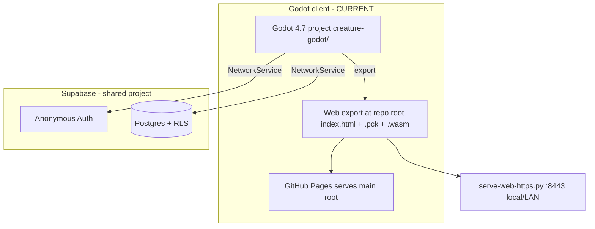

# Architecture, networking & sync

> Read this when changing **multiplayer sync, Supabase calls, world-object state, or boot/session flow**.

## Two clients, one backend

| Client | Path | Status |
|--------|------|--------|
| **Godot 4.7** | `creature-godot/` (web export at **repo root** → GitHub Pages) | **Current game** |
| Web (legacy 2D) | `_arc/` | Archived; documents the original Supabase patterns |

Backend: one shared Supabase project — anonymous auth + Postgres with RLS. **No Realtime/replication**: everything is REST polling (~1.5s). Web-export HTTP goes through the `CreatureNet` fetch bridge in `creature-godot/web/custom_shell.html` (Godot `HTTPRequest` fails in wasm without COI).

## Boot & session (`network_service.gd`, `main.gd`)

```text
main.gd _ready()
  -> await NetworkService.boot()              # anonymous auth + load session profile
  -> show onboarding if no profile exists     # login/register/continue (pattern lock)
  -> _begin_world() -> world_map.spawn_player()
  -> NetworkService.start_creature_poll(...)  # when online
```

- Refresh token in `user://supabase_session.json` (editor) or localStorage `creature_supabase_session` (web via CreatureNet). Boot is silent on success; offline toasts "Could not reach server — starting locally".
- **Login/register:** `register_profile()` / `login_profile()` with a 3×3 pattern lock (`sha256("creature:<NAME>:<dots>")` in `creatures.pattern_hash`). Names stored/looked-up UPPERCASE. Rides the temporary name-claim RLS policy (replace before real shipping).
- **JWT refresh:** proactive every 40 min + retry-once on any REST 401 (`_rest_request_raw`).
- **Presence heartbeat** (60s) keeps `last_active` fresh so idle players stay in others' online-only polls and keep their possessed objects.

## Creature polling

1. `fetch_all_creatures(true)` → GET with trimmed columns + `last_active >= now − 150s` (online-only; admin list passes false for all profiles). First fetch uses `select=*` to probe optional columns (`form`) before trimming.
2. `world_map.sync_remote_creatures(rows)` spawns/updates/removes remote creatures keyed by `user_id`; they interpolate toward server x/y (snap if jump > `REMOTE_SNAP_TILES`).
3. `creatures.form` syncs each player's current form.
4. Position saves: local movement is immediate; PATCH `{x,y}` on a 1.5s timer plus flush on path complete / respawn / logout.

## Shared world objects (`world_objects` table)

Positions are tile coords matching `creatures.x/y`. Types: interactive props (`altima`, `truck`, `house`, `atm`, …), money (`money_stack/money_bag/vault`), and **transient event rows** (`smoke_cloud`, `explosion`, `kill_event`, `abduction`) that `WorldMap.sync_world_objects()` intercepts as temporary FX instead of props.

- **Possession:** Becoming an object marks its row `possessed` + `possessed_by=<uid>` (prop hidden for everyone — no duplicate). Pop-out releases it `idle` at the parked tile. Session restore re-adopts a possessed row (`adopt_possessed_object`).
- **Carried money:** `state='carried'` + `possessed_by=<uid>`.
- **`owner_name` is overloaded** per type: money owner labels; house segments `home:x,y|safe:NAME|big|vaults:N|robbed:<unix>:<NAME>`; ATM/prop reseed markers `reseed:<due_unix>`; kill-event message text. Parse/set helpers live in `world_object.gd` (`set_owner_segment()` preserves other segments — always use it when PATCHing).
- **Client-local authority (by design for the prototype):** kills, combines, claims, robberies are decided by the acting client; simultaneous actions can race. Server-authoritative pass deferred.

### Sync-robustness rules (do not break these)

- **Local-authority grace** — object ids you just changed ignore stale server rows ~6s while the PATCH lands (anti-flicker). Call `_note_local_authority(id)` after local mutations.
- **Tombstones** — locally-deleted ids can't be resurrected by an in-flight poll (~15s). Call `_note_deleted(id)`.
- **Per-request web bridge** — browser fetch responses are keyed by request id (overlapping requests used to cross responses and drop PATCHes).
- **Self-repair** — rows claiming *you* carry/possess something you don't get PATCHed back to idle.
- **Graceful degradation** — every optional table/column is probed (`_world_objects_available`, `_announcements_available`, `_owner_name_column_available`, …); a missing migration logs a notice once and disables the feature, never crashes. Follow this pattern for new tables/columns.

### Seeding / reset

`NetworkService.seed_world_objects()` seeds an empty world; per-slice top-up markers append missing groups to existing worlds. Admin **reset ALL world objects** wipes + reseeds from `_build_world_object_seed()` — **add new seed groups there** so reset/top-up stay complete. Seeds run a spreading pass (no shared tiles, no seeds inside solids) and avoid roads for parked vehicles/ATMs.

## Announcements

`public.announcements` (see `docs/supabase-backend.md` for the migration/REST commands). `NetworkService` polls the newest row every 30s (`ANNOUNCE_POLL_SEC`) and emits `announcement_received(id, message)`; the HUD popups unseen ids and persists acknowledgement locally (localStorage / `user://announcement_seen.txt`). `create_announcement(msg)` for the admin composer.

## Architecture diagram


