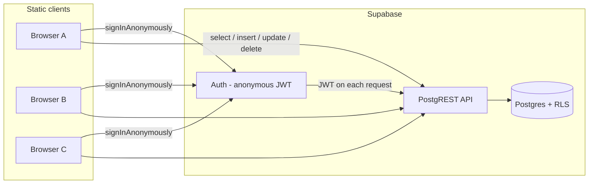

# Supabase multiplayer pattern — Creature game

This document explains how **Creature** uses Supabase as a backend for a shared, browser-hosted multiplayer experience. The pattern is intentionally simple: a static client (GitHub Pages) talks to Supabase over HTTPS. No custom game server is required.

An engineer can reuse this architecture for other lightweight multiplayer games (lobbies, shared worlds, turn-based games, presence lists, etc.) by swapping table shapes and sync rules.

---

## What “real-time multiplayer” means here

Creature is **real-time-ish**, not a dedicated low-latency game server:

| Layer | Approach | Latency feel |
|-------|----------|--------------|
| **Other players’ positions** | Poll `creatures` every ~1.5s | Slight lag, acceptable for slow tile movement |
| **Your own position** | Write to DB on each completed move + periodic heartbeat | Authoritative on your client between polls |
| **Combat / eat** | Immediate REST writes | Other clients see result on next poll |
| **Offline notifications** | Event rows (`creature_events`) read on next login | Works even if victim closed the tab |

This is a common pattern for hobby / Phase-1 games: **Postgres is the source of truth**, clients **optimistically render locally** and **reconcile** when fresh rows arrive.

### Optional upgrade: Supabase Realtime

The repo still includes `subscribeCreatures()` in `js/api.js`, which listens to Postgres changes over websockets:

```js
supabase
  .channel('creatures-live')
  .on('postgres_changes', { event: '*', schema: 'public', table: 'creatures' }, onChange)
  .subscribe();
```

Creature **currently uses polling** instead (free-tier friendly, no Replication toggle required). To switch:

1. Dashboard → Database → Replication → enable `creatures`
2. Replace the `setInterval(pullCreatures)` loop with `subscribeCreatures(pullCreatures)`

Use Realtime when you need snappier updates; keep polling when you want minimal setup and predictable REST usage.

---

## Architecture overview



**Key idea:** every player gets a unique `auth.users` row via anonymous sign-in. Game entities (`creatures`) reference `user_id`. Row Level Security (RLS) decides who can read/write what.

---

## Authentication: anonymous players, no login UI

Creature uses **Supabase Anonymous Auth** so players never see a sign-up form. Each browser session gets its own user id persisted in local storage by `@supabase/supabase-js`.

```js
// js/api.js
export async function ensureAnonymousAuth() {
  const { data: { session } } = await supabase.auth.getSession();
  if (session) return session;

  const { data, error } = await supabase.auth.signInAnonymously();
  if (error) throw error;
  return data.session;
}
```

**Dashboard requirement:** Authentication → Providers → **Anonymous sign-ins → ON → Save**.

### Why anonymous auth fits static multiplayer

- Works from **GitHub Pages** (only the publishable key is in the client).
- Each tab/device is a distinct player unless you add account linking (Phase 2 passkey).
- JWT is sent automatically on every query; RLS uses `auth.uid()`.

### Adapting for another game

| Need | Pattern |
|------|---------|
| Guest play | Anonymous auth (this app) |
| Persistent identity | Link anonymous user to email/OAuth later, or custom passkey table |
| Private rooms | Add `room_id` column + RLS `using (room_id = current_setting(...))` or membership table |

---

## Data model

Three tables cover world state, player avatars, and async notifications. Full DDL: [`supabase/schema.sql`](../supabase/schema.sql).

### `creatures` — one row per player (authoritative avatar state)

| Column | Purpose |
|--------|---------|
| `user_id` | FK to `auth.users`, unique (one creature per player) |
| `x`, `y` | World position (float for smooth movement) |
| `health`, `stamina`, `size_level` | Gameplay stats |
| `is_asleep` | AFK / tab hidden |
| `last_active`, `updated_at` | Presence / debugging |

### `map_objects` — shared static world (trees, etc.)

Read-only for clients. Seeded once via SQL. All authenticated users can `select`.

### `creature_events` — messages for players who were offline

When player A eats player B, B’s creature row is **deleted**. B might not be online to see that. An event row is inserted so B sees *“Your creature was eaten by X”* on next visit.

This is the **inbox / notification queue** pattern: cheap, works without push notifications.

---

## Row Level Security (RLS)

RLS is what makes a publishable key safe in the browser. Without it, anyone with the key could read/write everything.

Creature policies (simplified):

```sql
-- Everyone logged in can see all creatures (multiplayer visibility)
create policy "creatures_select" on public.creatures
  for select to authenticated using (true);

-- Only insert/update your own creature
create policy "creatures_insert" on public.creatures
  for insert to authenticated with check (auth.uid() = user_id);

create policy "creatures_update_own" on public.creatures
  for update to authenticated using (auth.uid() = user_id);

-- Eat: delete smaller creatures if your creature is bigger
create policy "creatures_delete_smaller" on public.creatures
  for delete to authenticated using (
    exists (
      select 1 from public.creatures eater
      where eater.user_id = auth.uid()
        and eater.size_level > creatures.size_level
    )
  );
```

### Design rules for your game

1. **`select` as open or scoped** — open for battle royale / MMO-lite; scoped by `room_id` for instanced matches.
2. **`insert` / `update` only own rows** — prevents spoofing another player’s avatar.
3. **Cross-player effects in RLS or RPC** — fight damage updates *target* row: Creature allows updating any creature’s `health` only because there is no restrictive policy on `update` for others… **Note:** current schema allows any authenticated user to `update` any creature if you add a broad policy. In Creature, `doFight()` calls `updateCreature(target.id, { health })` — this **requires** either:
   - a policy allowing health updates on others (not currently explicit — verify your deployed policies), or
   - a **Postgres function** (`security definer`) for combat.

**Important for engineers forking this:** review fight/eat policies before production. Safer pattern:

```sql
create or replace function apply_damage(target_id uuid, amount int)
returns void language plpgsql security definer as $$
begin
  update creatures set health = greatest(0, health - amount) where id = target_id;
end;
$$;
```

Call via `supabase.rpc('apply_damage', { target_id, amount })` with strict checks inside the function.

---

## Client ↔ database sync loop

### Boot sequence (`js/main.js`)

```mermaid
sequenceDiagram
  participant C as Client
  participant A as Supabase Auth
  participant DB as Postgres

  C->>A: getSession()
  alt no session
    C->>A: signInAnonymously()
  end
  C->>DB: select creature where user_id = auth.uid()
  C->>DB: select unread creature_events
  alt no creature
    Show welcome / create flow
  else has creature
    Load game + fetch all creatures + map_objects
  end
```

### During gameplay (`js/game.js`)

**Writes (local player):**

| Trigger | API call |
|---------|----------|
| Finished moving one tile | `updateCreature(id, { x, y, stamina })` |
| Every ~400ms while idle | Heartbeat: position, stats, `is_asleep` |
| Fight / eat / sleep | Immediate `update` / `delete` / `insert` event |

**Reads (everyone else):**

```js
setInterval(() => pullCreatures(), 1500); // fetchAllCreatures()

async pullCreatures() {
  const list = await api.fetchAllCreatures();
  // Merge into local Map; interpolate renderX/renderY for smooth display
}
```

**Local interpolation:** remote creatures lerp toward last known `(x, y)` so movement looks smooth between polls.

### Adapting sync rates

| Game type | Suggested poll | Write frequency |
|-----------|----------------|-----------------|
| Slow tile RPG (Creature) | 1–2s | On move complete |
| Top-down action | 200–500ms or Realtime | Every frame or velocity tick |
| Turn-based | On turn only | Event-driven |

---

## API surface (`js/api.js`)

All network I/O is centralized in one module — copy this layout into another project:

| Function | Supabase operation | Multiplayer role |
|----------|-------------------|------------------|
| `ensureAnonymousAuth()` | Auth | Session per device |
| `fetchMyCreature(userId)` | `select … maybeSingle` | Restore save state |
| `fetchAllCreatures()` | `select *` | World population |
| `fetchMapObjects()` | `select *` | Static level data |
| `createCreature(row)` | `insert … select` | Join world |
| `updateCreature(id, patch)` | `update` | Movement, stats, sleep |
| `deleteCreature(id)` | `delete` | Eat / despawn |
| `recordEatenEvent` / `fetchUnreadEvents` | `insert` / `select` | Offline notifications |
| `subscribeCreatures(onChange)` | Realtime channel | Optional live sync |

Client creation:

```js
import { createClient } from '@supabase/supabase-js';

export const supabase = createClient(SUPABASE_URL, SUPABASE_PUBLISHABLE_KEY);
```

Use the **publishable** key (`sb_publishable_…`) in static frontends. Never ship the **secret** key.

---

## Hosting: GitHub Pages + Supabase

```
Static site (HTML/JS)  →  GitHub Pages
Game state             →  Supabase Postgres
Auth                   →  Supabase Auth (anonymous)
```

No WebSocket server to deploy. CORS is handled by Supabase for your project domain once the client uses the official JS SDK.

**Config in this repo:** `js/config.example.js` (committed, public keys only). GitHub Pages imports that file directly.

---

## Free tier and cost awareness

Creature avoids Supabase **Realtime replication** and uses REST polling to stay within free-tier expectations:

- Auth (anonymous sessions)
- Postgres storage + queries
- No extra “compute” instance for a game server

Monitor:

- Number of `select * from creatures` calls (scales with players × poll rate)
- Row churn from frequent `update` heartbeats

Optimizations for larger games:

- Poll only nearby entities (`where x between … and y between …`)
- Increase poll interval when alone in world
- Switch hot paths to Realtime channels
- Use `updated_at` + `select where updated_at > $last_seen` (delta sync)

---

## Checklist: port this pattern to a new game

1. **Design tables** — one primary row per player + shared world tables + optional event/inbox table.
2. **Enable RLS** on every public table; default deny, then add policies.
3. **Choose auth** — anonymous for guests; email/OAuth when you need persistence.
4. **Centralize API** — one module wrapping `supabase.from()` / `rpc()` / `channel()`.
5. **Boot flow** — auth → load self → load world → start game loop.
6. **Sync strategy** — poll vs Realtime; interpolate remote entities client-side.
7. **Authoritative writes** — player only writes own row; cross-player actions via RPC or carefully scoped policies.
8. **Offline events** — queue table with `read` flag for anything that must survive disconnects.
9. **Static deploy** — publishable key only; run `schema.sql` in Supabase SQL Editor.

---

## File reference (Creature)

| File | Responsibility |
|------|----------------|
| [`supabase/schema.sql`](../supabase/schema.sql) | Tables, indexes, RLS, seed data |
| [`js/api.js`](../js/api.js) | Supabase client + all queries |
| [`js/main.js`](../js/main.js) | Auth boot, create creature, error handling |
| [`js/game.js`](../js/game.js) | Poll loop, write heartbeat, gameplay side effects |
| [`js/config.example.js`](../js/config.example.js) | Project URL + publishable key |

---

## Summary

Supabase gives Creature a **multiplayer backend without a custom server**: Postgres stores shared state, anonymous JWTs identify players, RLS enforces boundaries, and the browser **polls (or optionally subscribes)** to stay in sync. Async **event rows** handle offline players. The same skeleton—auth → CRUD → periodic world fetch → local interpolation—scales to many small multiplayer web games before you need dedicated game infrastructure.

---

## Godot client (pivot — session + position only)

The Godot build (`creature-godot/`) reuses the same Supabase project but with a **slim scope** for now:

| Feature | Status |
|---------|--------|
| Anonymous auth + refresh token in `user://supabase_session.json` | Implemented |
| Restore spawn position from `creatures.x`, `creatures.y` | Implemented |
| Save position on move (debounced PATCH) | Implemented |
| Health / stamina in Godot UI | **Removed** (DB columns kept for legacy web) |
| Other players / fight / eat / events | Not yet |

**One-time SQL:** run [`supabase/migration-godot-session.sql`](../supabase/migration-godot-session.sql) to allow `appearance = 'worm'`.

Implementation: [`creature-godot/scripts/autoload/network_service.gd`](../creature-godot/scripts/autoload/network_service.gd). Boot flow in [`creature-godot/docs/godot-porting-notes.md`](../creature-godot/docs/godot-porting-notes.md).

